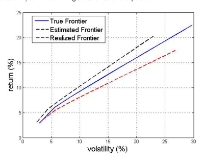

# 8. Credit Modeling and Credit Derivatives

#

In these lecture notes we introduce the main approaches to credit modeling and we will largely follow the excellent development in Chapter 17 of the 2 nd edition of Luenberger's *Investment Science*. In recent years credit modeling has become an extremely important component in the derivatives industry and risk management in general. Indeed the development of credit-default-swaps (CDSs) and other more complex credit derivatives are widely considered to have been one of the contributing factors to the global financial crisis of 2008 and beyond. These notes will also prove useful for studying certain aspects of corporate finance - a topic we will turn to at the end of the course.

## 1 Structural Models

The structural approach to credit modeling began with Merton in 1974 and was based on the fundamental accounting equation Assets = Debt + Equity (1)
which applies to all firms (in the absence of taxes). This equation simply states the obvious,  namely that the asset-value of a firm must equal the value of the firm's debt and the firm's equity. This follows because all of the profits generated by a firm's assets will ultimately accrue to the debtand equity-holders. While more complicated than presented here,  the *capital structure* of a firm is such that debt-holders are more senior than equity holders. That means that in the event of [[Course Notes/HBR Notes/A Strategic Perspective on Bankruptcy|bankruptcy]] debt-holders must be paid off in full before the equity-holders can receive anything. This insight allowed Merton1to write the value of the equity at time T,
ET,  as a call option on the value of the firm,  VT with strike equal to the face value of the debt,  DT. Merton's model therefore implies ET = max (0,  VT − DT) (2)
with default occurring if VT < DT. Note that (2) implicitly assumes that the firm is wound up at time T and that default can only occur at that time. These assumptions are not very realistic and have been relaxed in many directions since Merton's original work. Nonetheless,  we can gain many insights from working with (2).

First of all,  we can take Vt to be the value of a traded asset (why?) so that risk-neutral pricing applies. If the firm does not pay dividends then we could assume,  for example,  that Vt ∼ GBM(*r,  σ*) so that Et is the corresponding Black-Scholes price of a call option with maturity T,  strike DT and underlying security value Vt.

From this we can compute other interesting quantities such as the (risk-neutral) probability of default.

## 1.1 Structural Lattice Models

While closed-form solutions can be obtained for the equity and debt values in Merton's model (as well as the Black-Cox extension we discuss below) it will be convenient to do much of our work in lattice models as they will allow us to concentrate on the financial rather than mathematical aspects of the modeling.

## The Merton Model

We assume the following parameters: V0 = 1,  000,  T = 7 years,  µ = 15%,  σ = 25%,  r = 5% and the \# of time periods = 7. The face value of the debt is 800 and the coupon on the debt is zero. The first task is to construct the lattice model for Vt and we do this following our usual approach to lattice construction. That is,  we take 1But Black and Scholes also recognized the implications of option pricing for valuing corporate securities in their 1973 paper.

ν =µ − σ 2/2,  ln u =
qσ 2∆t + (ν∆t)
2,  d = 1/u and risk-neutral probability of an up-move q = (e r∆t − d)/(u − d). The resulting lattice of firm values is displayed below with values at time T
corresponding to firm default marked with an asterisk.

| Firm Value Lattice   |        |        |        |        | 6940.6   |        |        |
|----------------------|--------|--------|--------|--------|----------|--------|--------|
|                      |        |        |        | 5262.6 | 3990.2   |        |        |
|                      |        |        | 3990.2 | 3025.5 | 2294.0   |        |        |
|                      |        | 3025.5 | 2294.0 | 1739.4 | 1318.9   |        |        |
|                      |        | 2294.0 | 1739.4 | 1318.9 | 1000.0   | 758.2* |        |
| 1739.4               |        | 1318.9 | 1000.0 | 758.2  | 574.9    | 435.9* |        |
| 1318.9               | 1000.0 | 758.2  | 574.9  | 435.9  | 330.5    | 250.6* |        |
| 1000.0               | 758.2  | 574.9  | 435.9  | 330.5  | 250.6    | 190.0  | 144.1* |
| t = 0                | t = 1  | t = 2  | t = 3  | t = 4  | t = 5    | t = 6  | t = 7  |

|       |       |       | 800.0   |        |        |        |        |
|-------|-------|-------|---------|--------|--------|--------|--------|
|       |       | 761.0 | 800.0   |        |        |        |        |
|       |       | 723.9 | 761.0   | 800.0  |        |        |        |
|       | 688.6 | 723.9 | 761.0   | 800.0  |        |        |        |
| 653.2 | 684.7 | 715.3 | 742.0   | 758.2* |        |        |        |
| 611.6 | 631.7 | 641.6 | 630.0   | 574.9  | 435.9* |        |        |
| 560.3 | 564.3 | 551.1 | 511.1   | 435.9  | 330.5  | 250.6* |        |
| 500.3 | 488.3 | 457.5 | 404.2   | 330.5  | 250.6  | 190.0  | 144.1* |
| t = 0 | t = 1 | t = 2 | t = 3   | t = 4  | t = 5  | t = 6  | t = 7  |

| Equity Lattice   |        |        | 6140.6   |       |       |       |       |
|------------------|--------|--------|----------|-------|-------|-------|-------|
|                  |        | 4501.6 | 3190.2   |       |       |       |       |
|                  | 3266.4 | 2264.5 | 1494.0   |       |       |       |       |
|                  | 2336.9 | 1570.2 | 978.4    | 518.9 |       |       |       |
| 1640.8           | 1054.7 | 603.6  | 258.0    | 0.0   |       |       |       |
| 1127.8           | 687.1  | 358.4  | 128.3    | 0.0   | 0.0   |       |       |
| 758.6            | 435.7  | 207.1  | 63.8     | 0.0   | 0.0   | 0.0   |       |
| 499.7            | 269.9  | 117.4  | 31.7     | 0.0   | 0.0   | 0.0   | 0.0   |
| t = 0            | t = 1  | t = 2  | t = 3    | t = 4 | t = 5 | t = 6 | t = 7 |

Now we are ready to price the equity and debt,  i.e. [[Class Notes 2 – Corporate Bond Contracts|Corporate Bonds]],  of the firm. We price the equity first by simply viewing it as a regular call option on VT with strike K = 800 and using the usual risk-neutral backward evaluation approach. The bond or debt price can then be computed similarly or by simply observing that it must equal the difference between the firm-value and equity value at each time and state. We see the initial values of the equity and debt are 499.7 and 500.3,  respectively. The credit spread can also be computed as follows. The yield-to-maturity,  y,  of the bond satisfies 500.3 = e
−yT × 800 which implies y = 6.7%. The credit spread2is then given by c = y − r = 1.7% or 170 basis points.

Note that we could also easily compute the true or risk-neutral probability of default by constructing an appropriate lattice. Note that it is also easy to handle coupons. If the debt pays a coupon of C per period,  then we write ET = max(0,  VT − DT − C) and then in any earlier period we have

$$E_{t}=\operatorname*{max}\left(0, \, \left[q E^{u}+(1-q)E^{d}\right]/R-C\right)$$

where R = e r∆tand Euand Edare the two possible successor nodes in the lattice corresponding to upand down-moves,  respectively. As before,  the debt value at a given node will be given by the difference between the firm and equity values at that node.

## The Black-Cox Model

The Black-Cox model generalizes the Merton model by allowing default to also occur before time T. In our example we can assume default occurs the first time the firm value falls below the face value of the debt. In that case we can compute the value of the equity by placing 0 in those cells where default occurs and updating other cells using the usual backwards evaluation approach. As before the debt value at a given cell in the lattice is given by the difference between the firm and equity values in that cell. This results in the following equity and debt lattices:

|       |        |        |        | 800.0   |        |        |        |
|-------|--------|--------|--------|---------|--------|--------|--------|
|       |        |        | 761.0  | 800.0   |        |        |        |
|       |        | 723.9  | 761.0  | 800.0   |        |        |        |
|       | 688.6  | 723.9  | 761.0  | 800.0   |        |        |        |
| 653.2 | 684.7  | 715.3  | 742.0  | 758.2*  |        |        |        |
| 623.6 | 658.2  | 699.9  | 758.2* | 574.9*  | 435.9* |        |        |
| 614.9 | 671.5  | 758.2* | 574.9* | 435.9*  | 330.5* | 250.6* |        |
| 650.0 | 758.2* | 574.9* | 435.9* | 330.5*  | 250.6* | 190.0* | 144.1* |
| t = 0 | t = 1  | t = 2  | t = 3  | t = 4   | t = 5  | t = 6  | t = 7  |

| Equity Lattice (Black-Cox)   |        |        | 6140.6   |        |       |       |       |
|------------------------------|--------|--------|----------|--------|-------|-------|-------|
|                              |        | 4501.6 | 3190.2   |        |       |       |       |
|                              |        | 3266.4 | 2264.5   | 1494.0 |       |       |       |
|                              | 2336.9 | 1570.2 | 978.4    | 518.9  |       |       |       |
|                              | 1640.8 | 1054.7 | 603.6    | 258.0  | 0.0   |       |       |
| 1115.8                       | 660.7  | 300.1  | 0.0      | 0.0    | 0.0   |       |       |
| 703.9                        | 328.5  | 0.0    | 0.0      | 0.0    | 0.0   | 0.0   |       |
| 350.0                        | 0.0    | 0.0    | 0.0      | 0.0    | 0.0   | 0.0   | 0.0   |
| t = 0                        | t = 1  | t = 2  | t = 3    | t = 4  | t = 5 | t = 6 | t = 7 |

We see that the debt-holders have benefitted from this new default regime with their value increasing from 500.3 to 650. Of course this increase has come at the expense of the equity holders whose value has fallen from 499.7 to 350. In this case the credit spread on the bond is -200 basis points! Negative credit spreads are generally not found in practice but have occurred in this case because the debt holders essentially own a down-and-in call option on the value of the firm with zero strike and barrier equal to the face value of the debt.

2Note that in general the credit spread for a firm's bonds is usually a function of the time-to-maturity of the bond in question.

It therefore makes more sense to talk about cT rather than just c. This is also true for credit-default swaps which we will discuss in Section 3.

The unreasonable value of the credit spread in this case is evidence against the realism of the specific default assumption made here. While it is true that a firm can default at any time,  the barrier would generally be much lower than the face value of the long-term debt of 800. Note that we could easily use a different and time-dependent default barrier to obtain a more realistic value of the credit spread.

## Other Structural Models

Structural models are very important in finance both for security pricing3 purposes as well as for more theoretical purposes where the goal is to answer corporate finance questions such as determining the (optimal)
capital structure of the firm. In determining the optimal capital structure of the firm it is important to include other important features such as [[Course Notes/HBR Notes/A Strategic Perspective on Bankruptcy|bankruptcy]] costs as well as the tax benefits of issuing debt. We may discuss some of these corporate finance questions later in the course. For now we simply note that there have been many refinements and generalizations of the Merton / Black-Cox approach to valuing corporate securities.

## 1.2 The Kmv Approach

A particularly successful implementation of structural credit modeling was developed by KMV4and we will now give an overview of their approach. The main difficulty in applying structural models is in identifying the firm value,  Vt. In principle,  one can observe Vt from the firm's balance sheet data but this process is noisy and very sensitive to assumptions. Instead,  KMV *inferred* Vt from the value of the debt - which is indeed taken from the balance sheet - and the *market* value of the equity,  Et. Ideally we would infer Vt as the implicit solution to

$$E_{t}=\mathsf{B S_{c a l l}}\left(V_{t}, T-t, r, \sigma, K\right)$$
$\left(3\right)$.
Et = BScall (Vt,  T − *t,  r,  σ,  K*) (3)
where T is taken to be some weighted average,  e.g. the duration,  of the time-to-maturity of the firm's debt,  and the strike,  K,  was chosen to be some value between the face value of the short-term debt and the face value of the total debt. But what value of σ should we use in (3)? KMV tackled this problem by taking a time-series of recent equity-value observations,  E1*,  …,  E*n,  and inverting (3) to obtain a time-series of firm valuations,  V1 = g(E1,  σ),  …,  Vn = g(En,  σ),  where g(·) is the inverse of BScall(·). Note that V1*,  …,  V*n are functions of the unknown parameter,  σ. Assuming Vt follows a GBM(*µ,  σ*) process under the true distribution,  P,  we can now use *maximum likelihood estimation* (MLE) methods to estimate (*µ,  σ*) (and therefore the time series of firm values,  V1*,  …,  V*n). Once the model had been fitted,  we can compute the distance-to-default,  DDt,  which is the number of yearly standard deviations,  i.e. σ,  by which log Vt exceeds log K. That is

$$D D_{t}:={\frac{\log\left(V_{t}/K\right)}{\sigma}}$$

One could use the fitted GBM model to compute the so-called expected default frequency (EDF) which is defined to be the probability of the firm defaulting within one year. Instead,  however,  KMV used their historical database of all firm default events to estimate the function f(·) for which EDF ≈ f(DD). Note the same f(·) is used for all firms.

## 2 Ratings Models

An alternative approach to modeling default events is via ratings transitions. The main ratings agencies –
Moody's,  Standard & Poors and Fitch - produce and publish ratings of financial instruments issued by firms and governments. These ratings are intended to signify the credit-worthiness of these instruments with safer 3In addition to corporate debt,  structural models are also sometimes used to build **capital structure arbitrage** models where the goal is to identify (relative) mispricings between the various securities in a firm's capital structure. In contrast to the simplified models above,  these securities include equity,  different types of debt (senior secured,  senior unsecured etc.) as well as hybrid securities such as convertible bonds and contingent convertibles or "co-co's".

4KMV (Kealhofer,  McQuown and Vasicek) was a very successful (credit) risk management firm that was purchased by Moody's in 2002.
securities having higher ratings. For example,  a security rated AAA is believed to be very secure and have almost no risk of default. These ratings are updated periodically as the prospects of the firms (or governments!) change. One way to model these periodic updates is via a Markov chain. For example,  we could use historical ratings transitions to estimate the transition matrix,  P,  which applies to Standard & Poors ratings. An example of such a matrix is given below.

|         |       | End State   |      |       |       |       |      |         |      |
|---------|-------|-------------|------|-------|-------|-------|------|---------|------|
|         | AAA   | AA          | A    | BBB   | BB    | B     | CCC  | Default |      |
| AAA     | 90.81 | 8.33        | 0.68 | 0.06  | 0.12  |.     |.    |         |      |
| AA      | 0.70  | 90.65       | 7.79 | 0.64  | 0.06  | 0.14  | 0.02 | -       |      |
| Initial | A     | 0.09        | 2.27 | 91.05 | 5.52  | 0.74  | 0.26 | 0.01    | 0.06 |
| State   | BBB   | 0.02        | 0.33 | 5.95  | 85.93 | 5.30  | 1.17 | 1.12    | 0.18 |
| BB      | 0.03  | 0.14        | 0.67 | 7.73  | 80.53 | 8.84  | 1.00 | 1.06    |      |
| B       | -     | 0.11        | 0.24 | 0.43  | 6.48  | 83.47 | 4.07 | 5.20    |      |
|         | 0.22  | 0.22        | 1.30 | 2.38  |       | 64.85 |      |         |      |
| CCC     |       |.           |      |       | 11.24 | 19.79 |      |         |      |

P: i s then the probability that a firm with rating i will be rated j one year or one quarter from now. Note that we have omitted the final row of the matrix since once a firm is in default it is assumed® to stay in default.

These ratings transition models were popularized by CreditMetrics and J.P. Morgan in the late 1990's. Their approach to credit risk was to assume that the credit rating of a company was well-modeled by a Markov chain with transition matrix P as above. It was then easy to compute the probability of default (or indeed losses / gains due to a deterioration / improvement in credit quality) over any period of time. For example,  it is easily seen that the matrix Pb coincides with the transition matrix corresponding to k time periods. More generally,  we could use a database of ratings transitions to estimate a continuous-time Markov model so that ratings transitions could occur at any time instant. This of course is more realistic. In order to compute risk measures such as Value-at-Risk (VaR) for credit portfolios consisting of the securities of different firms,  it is necessary to model the joint ratings transition of many companies. This can be achieved using copula methods. Monte-Carlo methods can then be used to estimate various quantities of interest.

## Credit-Default Swaps 3

Credit default swaps (CDS's) are a very important class of derivative instrument that was developed in the late 1990's and is now ubiquitous in the financial markets. They allow investors (or speculators) to hedge (or take on) the risk of default of a firm or government.

A CDS is structured like an insurance policy between two parties. Party A agrees to pay party B a fixed amount every period (typically every quarter),  in return for protection against the default of a third party,  C. These payments constitute the premium leg and the size of the payments are proportional to the notional amount,  N. When a default occurs,  party B must pay party A the difference between N and the market value of the reference bond (with notional N) issued by party C.

Protection buyer




(It is also possible to have physical settlement whereby upon default the protection buyer delivers the reference bond to the protection seller and receives the face value of the bond in return.) This payment constitutes the default leg of the CDS. The three parties (A,  B and C) are referred to as the protection buyer,  the protection

*Of course many companies come out of [[Course Notes/HBR Notes/A Strategic Perspective on Bankruptcy|bankruptcy]] but only after their debt and other contracts have been renegotiated.

From the point of view of credit modeling there is no problem with the assumption that there is no escape from default.
seller and the *reference entity*,  respectively. The CDS has a maturity date,  T,  and all payments cease6at min(*τ,  T*) where τ is the default time of the reference entity,  party C.

## 3.1 Pricing A Cds In General

We price a CDS by equating the risk-neutral value of the premium and default legs and from this we can determine the fair *annual spread* that the protection buyer must pay to the protection seller.

## The Premium Leg

Suppose the premium leg of the CDS has n payment times,  t1*,  …,  t*n = T and let us assume that default can only occur at one of these times. Then the fair value,  P0,  of the premium leg at time t = 0 is given by

$$P_{0}=s_{0}^{T}N\, \sum_{i=1}^{n}Z_{0}^{t_{i}}\alpha_{i}\, P(\tau>t_{i})\tag{1}$$
$$\quad(4)$$

where Z
ti 0is the discount factor,  i.e. the price of a riskless zero-coupon bond with face value 1 that matures at time ti,  N is the notional and αi = ti − ti−1 is the accrual period (in years) between the (i − 1)th and i th payments. The annualized CDS spread is s T 0
.

## The Default Leg

The fair value,  D0,  at time t = 0 of the default leg satisfies

$$D_{0}=(1-R)N\sum_{i=1}^{n}Z_{0}^{t_{i}}\, P(\tau=t_{i})$$

$\downarrow$.

0 P(τ = ti) (5)
where R is the so-called *recovery rate*,  i.e. the percentage of the face value of the reference bond that is recovered by a bond-holder upon default of the reference entity. It is common (though not necessarily advisable)
to assume that R is a fixed constant,  e.g. 40%.

## Obtaining The Fair Cds Spread

The spread,  s T 0
,  is obtained by equating P0 with D0 so that the CDS has zero value for both parties at the beginning of the contract. This implies

$$s_{0}^{T}=\frac{(1-R)\sum_{i=1}^{n}Z_{0}^{t_{i}}\, P(\tau=t_{i})}{\sum_{i=1}^{n}Z_{0}^{t_{i}}\, \alpha_{i}\, P(\tau>t_{i})}.\tag{1}$$
$$({\mathfrak{f}}{\mathfrak{o}})$$

```latex
A plot of s
          T
          0
             against T then shows the term-structure of CDS spreads. Just like the term structure of interest

```

rates moves in response to general economic conditions,  the term structure of credit spreads will move in response to general economic conditions as well as changes in the general outlook for the reference entity.

## 3.2 Some Specific Models

In order to compute a specific value for s T
0 we must have a (risk-neutral) default model in order to compute the various probabilities in (6). We now consider a few possible approaches before considering more general stochastic intensity models in Section 4.

6This is not true for a CDS written on an index containing multiple reference entities. In that case there can be many default-leg payments,  one for each reference entity. The notional of the CDS,  however,  is reduced appropriately after each default event.

## Structural Models

We can certainly compute s T
0 using structural models as described in Section 1. Indeed one can use the lattice models there to compute the fair value of s T 0 assuming7 default is possible at every time period and premia are also paid in every period. This is left as an exercise!

One of the main weaknesses of the structural approach to pricing CDS's is that the default event is said to be predictable. In particular,  consider for example the Black-Cox model. Default is impossible in the next time period in that model unless the firm value is very close to the default boundary. And if the firm value is far from the default boundary then default in the next several periods will also be impossible. In contrast,  if we let the length of a time period,  ∆t,  go to zero and the firm value process is extremely close to the default boundary then default will happen for sure8very soon. This is what we mean when we say default is predictable. In the real-world,  however,  default is not predictable. The default of many firms can come as a complete surprise to the market. This is true for firms such as Enron and Parmalat where default was caused by the discovery of huge accounting frauds. Even when the market sees that a firm,  e.g. Lehman Brothers,  is in financial difficulty so that the CDS spreads of that firm have widened,  the actual default event itself is still a surprise and (in a mathematical sense) unpredictable.

Intensity models are commonly used to circumvent this problem. These models do not model the economic value of the firm and hence are often termed *reduced-form* models. The (inhomogeneous) Poisson process intensity models that we discuss next are examples of deterministic intensity models.

## Using A Poisson Process To Model Default

We now assume the arrival of default follows a Poisson process9 with parameter λ so that P(τ ≤ t) = 1 − e
−λt we can clearly compute s T
0 using (6) but with the term P(τ = ti) in the numerator now replaced by P(ti−1 < τ ≤ ti). We can also compute the time t = 0 value,  V0,  of a zero-coupon bond with face value F and maturity T. If the recovery-rate upon default is a known value,  R,  that is paid at the time of default,  τ,  then we have

$$V_{0}={\rm E}_{0}^{Q}\left[e^{-rT}F1_{\{\tau>T\}}+\int_{0}^{T}e^{-rt}RF\, 1_{\{\tau=t\}}\right]$$ $$=e^{-(r+\lambda)T}F\ +\ RF\int_{0}^{T}\lambda e^{-(r+\lambda)t}\, dt$$ $$=e^{-(r+\lambda)T}F\ +\ RF\frac{\lambda}{r+\lambda}\left(1-e^{-(r+\lambda)T}\right)$$
$$\left(7\right)$$
$\mathbf{a}=\mathbf{b}\cdot\mathbf{a}$ 5.
$\mathfrak{a}\mathfrak{t}\mathfrak{e}\mathfrak{r}$ λ.
$\square$
−(r+λ)T(7)
where we have used the fact that time to default is exponentially distributed with parameter λ.

Using an Inhomogeneous Poisson Process to Model Default A clear weakness with the Poisson model is that there is just a single parameter,  λ,  that we are free to choose.

In practice,  however,  there are typically liquid CDS spreads s T
0
,  for several values of T. Typical values are T = 1,  3,  5,  7 and 10 years. Unless the term structure of credit spreads is constant (which is almost never the case) then it will be impossible to choose λ so that the model values of s T 0 coincide with the corresponding market values for all values of T.

We can resolve this problem using an inhomogeneous Poisson process where the arrival rate,  λt,  is a deterministic function of time,  t. For such a process,  the probability of zero arrivals in the interval (*t,  t* + ∆t) is then approximately e
−λt∆t. Using this we obtain the survival probability

$P(\tau>t)=e$.
−R t 0 λs ds. (8)
7It would be straightforward (if a little tedious) to use the structural lattice models of Section 1 to compute s T
0 on the assumption that default can occur in any time period but that the payments of the premium leg are only paid every m periods say. This is also true of the intensity-based lattice models of Section 4 and for that reason we will assume the premium leg payments are paid in every period.

8These arguments can be made mathematically precise.

9This means that default can now take place at any time in (ti−1,  ti] and for any i.
We can now use (8) to compute CDS spreads according to (6) but with the term P(τ = ti) in the numerator of
(6) now replaced by P(ti−1 < τ ≤ ti). We can also calibrate the inhomogeneous Poisson process model to the CDS spreads observed in the market. In particular,  we can assume λt is piecewise constant on the intervals
(0,  T1], (T1,  T2],  …, (Tn−1,  Tn] where T1 < T2 < · · · < Tn are the maturities of CDS spreads observed in the market. We can then use (6) to first calibrate λ0, T1 and to then calibrate each of λT1, T2
,  …,  λTn−1, Tn in turn.

## 4 Stochastic Intensity Models

While the inhomogeneous Poisson model can be calibrated to the CDS spreads seen in the market,  it does have a glaring weakness: the credit spreads at all future times are known today at time t = 0. This is because the intensity,  λt,  is deterministic. In practice,  however,  credit spreads are stochastic and so we would like to consider models where the default intensity is stochastic. We will consider here one important and tractable class of stochastic intensity models,  namely the doubly-stochastic or Cox process.

## Cox Processes

A Cox process is in fact an entire class of (point) processes. Before defining such a process we let Nt be the number of arrivals up to time t. When Nt follows a Poisson (inhomogeneous Poisson) process we know Nt has a Poisson distribution with parameter λt (R t 0 λu du). A cox process generalizes this by allowing the intensity λu to be stochastic. However,  conditional on knowing {λu}0≤u≤T then the number of arrivals in the interval [*s,  t*]
where 0 ≤ *s < t* ≤ T has an inhomogeneous Poisson distribution with parameter R t s λu du.

Such a process remains very tractable. For example,  if τ is the first arrival of a Cox process then we can compute the survival probability P(*τ > t*) as

$$P(\tau>t)=\mathrm{E}\left[1_{\{\tau>t\}}\right]\tag{1}$$ $$=\mathrm{E}\left[\mathrm{E}\left[1_{\{\tau>t\}}|\left\{\lambda_{u}\right\}0\leq u\leq t\right]\right]$$ $$=\mathrm{E}\left[e^{-\int_{0}^{t}\lambda_{u}\;du}\right]$$

where (9) follows from the fact that the point process is an inhomogeneous Poisson process on [0,  t] (and so τ has an exponential distribution) conditional on {λu}0≤u≤t.

We can now generalize (7) to obtain the fair value of a defaultable zero-coupon bond with face value F and recovery rate,  R,  that is payable upon default. In particular,  under a (risk-neutral) Cox process model,  we easily see that the time t = 0 value,  V0,  of such a bond satisfies

$$V_{0}=\mathbb{E}_{0}^{Q}\left[e^{-rT}F1_{\{r>T\}}+\int_{0}^{T}e^{-rt}RF1_{\{r=t\}}\right]\tag{10}$$ $$=\mathbb{E}_{0}^{Q}\left[e^{-\int_{0}^{T}(r+\lambda_{u})\, du}F\right]\ +\ RF\mathbb{E}_{0}^{Q}\left[\int_{0}^{T}\lambda_{t}e^{-\int_{0}^{t}(r+\lambda_{s})\, ds}\, dt\right]$$ $$=\mathbb{E}_{0}^{Q}\left[e^{-\int_{0}^{T}(r+\lambda_{u})\, du}F\right]\ +\ RF\int_{0}^{T}\mathbb{E}_{0}^{Q}\left[\lambda_{t}e^{-\int_{0}^{t}(r+\lambda_{s})\, ds}\right]\, dt.$$
$$\mathbf{\Sigma}(9)$$

A Cox process is only fully specified once we specify dynamics for λt. We will consider a lattice model for λt below but we also note that there are continuous-time models,  e.g. the CIR model,  for which (10) can be computed analytically. (The parameters of these models would then be chosen so that the model CDS spreads,  s T 0
,  match those observed in the market for different maturities,  T.)

## 4.1 Intensity-Based Lattice Models

We now build a lattice model for the intensity process. Following earlier interest rate models such as Ho-Lee or Black-Derman-Toy,  we let λk, s denote the intensity at time k and state s. We will assume that λk, s = ak + bs for some constants ak and b. (These constants can be used later to calibrate the model to CDS spreads and possibly other single-name credit derivatives such as CDS options.) At each node in the lattice there are actually 3 possible successor nodes corresponding to an up-move (in λ),  a default (which is a "terminal" state) or a down-move. We only need to show the upand down-moves when we actually draw the lattice. At any node,  the (risk-neutral) probability of default,  qdef,  is given by

$q_{\rm def}=1-e^{-\lambda\, \Delta t}$.
where ∆t is the length of a period and where λ depends on the particular node. In order to include a degree of mean-reversion in the lattice we allow the probabilities of upand down-moves to depend on λ. In particular,  we will assume

$$q_{\mathrm{{unp}}}$$
qup =λ0
$${\frac{\lambda_{0}}{\lambda+\lambda_{0}}}-{\frac{1}{2}}q_{\mathrm{def}}$$
$=\;\hdots$.
$$q_{\mathrm{down}}$$
qdown = 1 −λ0
$$:\quad1-{\frac{\lambda_{0}}{\lambda+\lambda_{0}}}-{\frac{1}{2}}q_{\mathrm{def}}$$

where λ0 is the intensity level about10 which the intensity mean-reverts. Note that qup + qdown + qdef = 1. The intensity lattice (with b chosen equal to0.\1) as well as the lattice of qup (with λ0 chosen equal to 2%) are shown below.

## Pricing A Coupon-Paying Bond

Suppose now that we wish to price a 10-year bond with face value 100m,  a 6% coupon paid annually and a recovery-rate of R = 0. We assume that each period corresponds to 1 year and that the first coupon is paid 1 year from now. The risk-free rate is 5%. The valuation lattice for this bond can be seen below.

We construct the bond lattice beginning at time t = 10 by noting that the bond value at a node is given by the sum of two quantities: (i) the survival probability for that node times the face value plus the coupon and (ii) the default probability for that node times the face value times the recovery rate. Earlier nodes are computed via backwards evaluation and accounting for both the coupon and the possibility of default at each node. In particular,  the value at any earlier node comes from two sources:
(i) if there is a default at that node then the value is simply the face value times the recovery rate.

(ii) if there is not a default at that node then the value is the coupon at that node plus the expected discounted value of the bond one period ahead.

We find11 an initial value of 82.64m.

## Computing The Fair Spread Of A Cds

Once the lattice model has been constructed it is easy to compute the fair spread of a CDS on this bond
(assuming payments for the premium leg are paid in every period,  i.e. in every year). Buying a CDS essentially changes the recovery rate to 100% at the cost of a reduced coupon. The size of the reduction in the coupon can be interpreted as the CDS spread. Therefore to find the *fair* CDS spread,  s 10 0
,  we can set R = 100% and reduce the coupon C until the fair value equals the original fair value of the bond,  82.64m. This leads to a fair CDS
spread of 3.39% or 339 basis points.

10Note that if *λ > λ*0 then qup < qdown and vice versa.

11Note that Example 17.9 of Luenberger yields a value of 66.79m but this is incorrect due to an error in the pricing formula used there. In particular,  the unnumbered equation on page 503 is incorrect and only the value "6" in that equation should be multiplied by the non-default probability,  e−0.\1. Interestingly enough,  the fair CDS spread reported by Luenberger in Example 17.10 is nonetheless identical to the spread we report below.

| Lambda Lattice   |             | 0.043   |       |                   |       |       |       |       |       |        |
|------------------|-------------|---------|-------|-------------------|-------|-------|-------|-------|-------|--------|
|                  |             | 0.042   | 0.041 |                   |       |       |       |       |       |        |
|                  |             | 0.041   | 0.04  | 0.039             |       |       |       |       |       |        |
|                  |             | 0.04    | 0.039 | 0.038             | 0.037 |       |       |       |       |        |
|                  |             | 0.04    | 0.038 | 0.037             | 0.036 | 0.035 |       |       |       |        |
|                  | 0.039 0.038 | 0.036   | 0.035 | 0.034             | 0.033 |       |       |       |       |        |
| 0.039            | 0.037       | 0.036   | 0.034 | 0.033             | 0.032 | 0.031 |       |       |       |        |
| 0.037            | 0.037       | 0.035   | 0.034 | 0.032             | 0.031 | 0.03  | 0.029 |       |       |        |
| 0.034            | 0.035       | 0.035   | 0.033 | 0.032             | 0.03  | 0.029 | 0.028 | 0.027 |       |        |
| 0.026            | 0.032       | 0.033   | 0.033 | 0.031             | 0.03  | 0.028 | 0.027 | 0.026 | 0.025 |        |
| 0.01             | 0.024       | 0.03    | 0.031 | 0.031 0.029 0.028 | 0.026 | 0.025 | 0.024 | 0.023 |       |        |
| t = 0            | t = 1       | t = 2   | t = 3 | t = 4             | t = 5 | t = 6 | t = 7 | t = 8 | t = 9 | t = 10 |

| Bond Lattice   |       |             | 101.54              |                            |               |                     |                     |       |       |        |
|----------------|-------|-------------|---------------------|----------------------------|---------------|---------------------|---------------------|-------|-------|--------|
|                |       | 98.49       | 101.74              |                            |               |                     |                     |       |       |        |
|                |       | 95.92       | 98.88               | 101.95                     |               |                     |                     |       |       |        |
|                |       | 93.76       | 96.46               | 99.26                      | 102.15        |                     |                     |       |       |        |
|                |       | 91.87       | 94.44               | 97.00                      | 99.64         | 102.35              |                     |       |       |        |
| 90.31 92.67    |       | 95.12       | 97.54 100.03 102.56 |                            |               |                     |                     |       |       |        |
| 88.94          | 91.21 | 93.47       | 95.80               | 98.09                      | 100.41 102.76 |                     |                     |       |       |        |
| 87.91          | 89.94 | 92.13       | 94.28               | 96.49                      | 98.64         | 100.80 102.97       |                     |       |       |        |
| 87.27          | 89.00 | 90.96       | 93.05               | 95.10                      | 97.18         | 99.19 101.19 103.18 |                     |       |       |        |
| 87.34          | 88.44 | 90.11       | 91.98               | 93.98                      | 95.92         | 97.88               | 99.74 101.58 103.38 |       |       |        |
| 82.64          | 88.59 | 89.62 91.22 | 93.01 94.92 96.75   | 98.58 100.29 101.97 103.59 |               |                     |                     |       |       |        |
| t = 0          | t = 1 | t = 2       | t = 3               | t = 4                      | t = 5         | t = 6               | t = 7               | t = 8 | t = 9 | t = 10 |

| q_up Lattice      | 0.296       |       |                   |       |       |       |       |       |       |        |
|-------------------|-------------|-------|-------------------|-------|-------|-------|-------|-------|-------|--------|
|                   | 0.308       |       |                   |       |       |       |       |       |       |        |
|                   | 0.302       |       |                   |       |       |       |       |       |       |        |
|                   | 0.308       | 0.314 | 0.320             |       |       |       |       |       |       |        |
|                   | 0.314       | 0.320 | 0.326             | 0.333 |       |       |       |       |       |        |
| 0.314             | 0.326       | 0.333 | 0.339             | 0.346 |       |       |       |       |       |        |
| 0.320 0.326       | 0.339       | 0.346 | 0.354             | 0.361 |       |       |       |       |       |        |
| 0.320 0.333 0.339 | 0.354       | 0.361 | 0.369             | 0.377 |       |       |       |       |       |        |
| 0.333             | 0.333 0.346 | 0.354 | 0.369             | 0.377 | 0.385 | 0.394 |       |       |       |        |
| 0.354             | 0.346       | 0.346 | 0.361             | 0.369 | 0.385 | 0.394 | 0.403 | 0.412 |       |        |
| 0.422             | 0.369       | 0.361 | 0.361 0.377       | 0.385 | 0.403 | 0.412 | 0.422 | 0.432 |       |        |
| 0.662 0.443       | 0.385       | 0.377 | 0.377 0.394 0.403 | 0.422 | 0.432 | 0.443 | 0.454 |       |       |        |
| t = 0             | t = 1       | t = 2 | t = 3             | t = 4 | t = 5 | t = 6 | t = 7 | t = 8 | t = 9 | t = 10 |

Figure 1: Intensity Process,  qup Process and Bond Values in Reduced Form Model
98.58 100.29 101.97 103.59