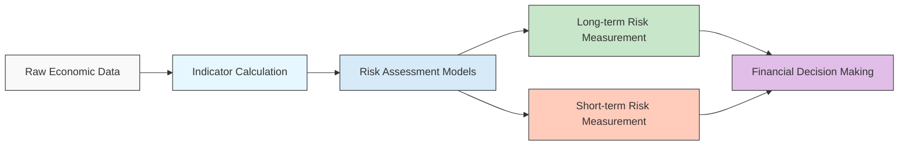
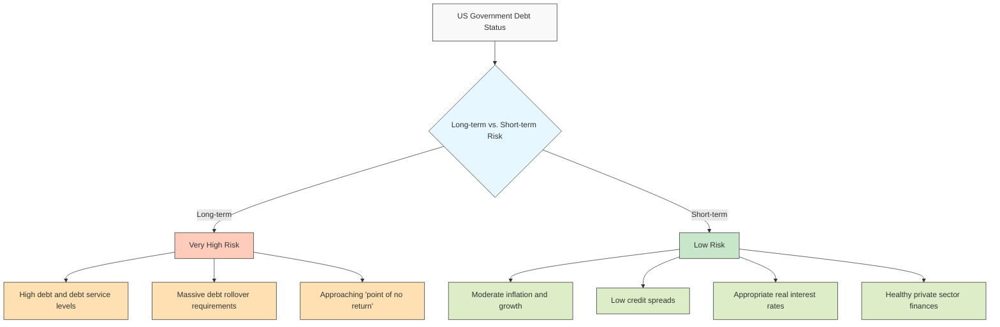
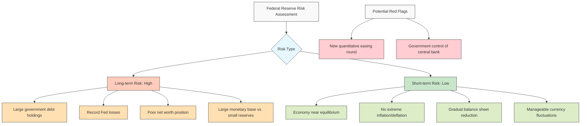
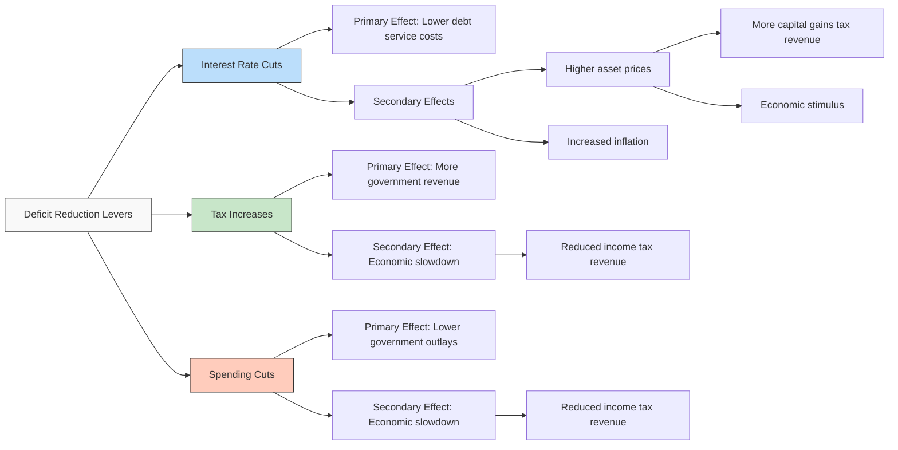
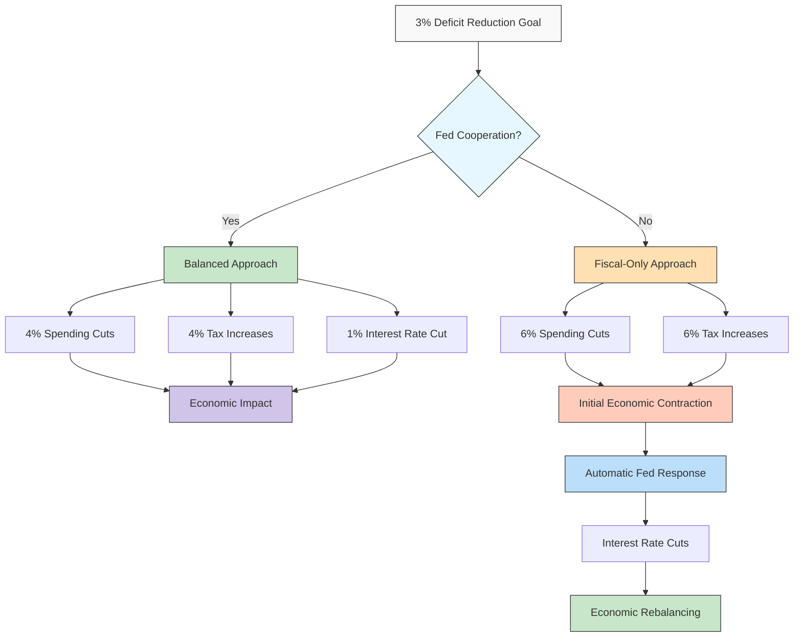
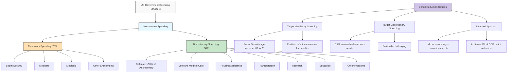
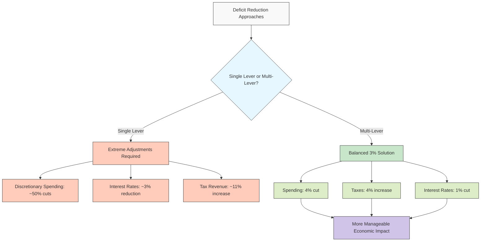

I'll rewrite the chapters in a more engaging and clearer manner while preserving all the details, illustrating economic chains with mermaid diagrams, and maintaining the markdown formatting.

# Chapter 15: What My Indicators Show

## My Indicators

In assessing financial risks, I employ numerous factors, with the most crucial ones displayed in the table below. These indicators, measured across major countries as of January 2025, provide a solid foundation for evaluating central government and central bank long-term debt risks. While not comprehensive, they paint a sufficiently accurate picture of each country's financial health. Consider this table a dashboard that captures the current state of financial well-being, allowing us to evaluate risks stemming from existing and projected debt and debt service levels. The table also indicates whether a country possesses reserve currency status—a significant risk mitigator, especially when the country represents an attractive investment destination, as is currently the case for the US and its financial instruments.

By examining these indicators, you can gain a clear understanding of each country's debt risks. The United States faces substantial central government debts (a major risk) coupled with low liquid savings/reserves (offering minimal protection), yet benefits considerably from its dominant world reserve currency status (a powerful risk mitigator). However, various US policies are gradually undermining this advantage. From this analysis, it becomes evident that America's financial well-being hinges critically on maintaining its existing reserve currency status.

Japan's central government carries massive debts (a significant risk), but these are denominated in its own currency (reducing the risk) and supported by relatively substantial foreign exchange reserves (further mitigating risk).

China faces relatively large debt (a risk factor), denominated in its own currency (risk-mitigating), backed by significant reserves (also risk-mitigating), but lacks a currency widely accepted globally as a storehold of wealth (offering little support). Additionally, while foreign investor interest in Chinese capital markets was moderately strong, it's now declining rapidly, diminishing the protection this would otherwise provide.

Singapore, Norway, and Saudi Arabia currently boast healthy income statements and balance sheets with substantially more liquid assets than debts, and similar financial profiles can be observed for the other countries displayed.

I aggregate these indicators into sophisticated models designed to reveal both the risks and rewards of potential economic scenarios.

## Long-Term and Short-Term Indicators of the Risks of Central Governments and Central Banks

Using these and other previously described indicators, I measure both long-term risks (analogous to assessing someone's risk of having a heart attack) and short-term risks (comparable to measuring an actual heart attack's occurrence and severity) for both central governments and central banks. While short-term risks often manifest when long-term vulnerabilities reach critical levels (similar to how someone with high heart attack risk eventually experiences one), this isn't universally true. External shocks like a pandemic or sudden military conflict can emerge even when underlying long-term vulnerabilities remain low, causing short-term risk gauges to spike. My measurements of both long-term and short-term risks appear below. Note that while these indicators provide valuable insights, they—like most predictive indicators of heart attacks—remain inherently imprecise for reasons explained earlier.

## The US Central Government's Debt Risks

The chart below displays my measurement of the US government's long-term debt risks (left) and short-term risks (right) dating back to 1900. Currently, I evaluate the long-term risks of US government debt as extremely high, given that current and projected levels of US government debt, debt service requirements, new debt issuance, and debt rollovers are at historic highs with substantial rollover risks on the horizon. In fact, the US government's debt situation is approaching what I call the "point of no return"—a threshold beyond which debt and debt service levels become virtually impossible to reduce without imposing significant losses on debt investors. At such extreme levels, a self-reinforcing debt "death spiral" develops, driven by the necessity to borrow simply to service existing debt while interest rates rise as the risks of holding the debt/currency become increasingly apparent.

Despite these long-term concerns, I assess the short-term risks as relatively low because inflation and growth remain moderately balanced, credit spreads are tight, real interest rates adequately compensate lender-creditors without overly burdening borrower-debtors, and the private sector's financial position—both income statements and balance sheets—remains comparatively healthy. This financial health in the private sector provides a potential taxation resource if needed to bolster central government finances. However, should demand for new debt issuance and debt rollovers decline significantly, or if widespread selling of debt assets occurs, short-term risk indicators would rapidly increase. It's worth noting that this gauge can shift dramatically—even overnight.

Below is a table showing key metrics that feed into my long-term risk rating for the US central government. These are measured in Z-scores (standard deviations above/below the mean). For context, scores above 2 indicate significant risk.

In summary, I believe there exists a very high _long-term_ risk of a US central government debt crisis of the type I've been describing, while simultaneously the _imminent_ risk of such a crisis materializing remains quite low.

## The US Central Bank's Debt Risks [1]

The charts below display my gauges of both long-term and short-term risks for the Federal Reserve. The long-term risk gauge currently registers higher than almost any point in history due to several factors: (a) the substantial volume of government debt held by the Fed, (b) record-breaking losses incurred by the Fed, and (c) the Fed's weak net worth position. However, these figures currently remain manageable in absolute terms. Thus, while long-term risk is present, it remains contained—though it could accelerate rapidly under certain conditions. At present, I assess the Fed's short-term risks as relatively low, with the US economy and markets operating near equilibrium levels.

More specifically, while current readings appear moderately concerning compared to historical norms—due to a large balance sheet inadequately backed by hard assets and experiencing limited cash flow losses—the situation remains manageable because the absolute figures aren't alarming and fall well short of levels that proved problematic for central banks in other countries where severe downward spirals developed. Additionally, several positive factors mitigate immediate concerns: (a) neither rapidly rising inflation nor deflation and falling prices pose immediate threats, (b) the Fed is gradually reducing its debt holdings rather than actively monetizing debt, and (c) currency fluctuations remain within manageable bounds that don't significantly impact inflation, growth, or monetary policy decisions.

In fact, the US economy currently appears to be in an excellent equilibrium position based on growth rates, inflation levels, real interest rates, and central bank debt monetization activities, which might create the misleading impression that all economic indicators are positive. However, significant challenges remain, particularly the government debt supply-demand dynamic we've discussed, which continues to grow like a cancer. Furthermore, the Fed's existing balance sheet carries losses that would increase, further eroding its capital base during a debt crisis. Beyond the direct financial risks, such developments would threaten the Fed's independence by subjecting its actions to heightened political scrutiny. If confidence in the Fed's independence diminishes, this would likely trigger a negative feedback loop as faith in the preservation of money's value erodes. Currently, we remain relatively distant from such a scenario.

Two developments that should be viewed as major red flags signaling grave risks to the real value of money and debt are: 1) another round of quantitative easing aimed at increasing liquidity and forcing real interest rates down, and 2) the central government gaining control over the central bank.

Below is a table showing key inputs to my long-term risk assessment for the US central bank. The central bank's income statement appears relatively stable, but its balance sheet shows unprecedented vulnerability due to the large monetary base (74% of GDP) coupled with minimal reserves (3% of GDP). While the income statement doesn't appear particularly alarming—despite the central bank's unprofitability—the absolute magnitude remains relatively modest.

As shown in the table, the United States maintains the world's dominant reserve currency, possesses dominant capital markets, and the dollar has performed adequately as a storehold of wealth. When aggregating these factors, the US emerges as a solid storehold of wealth, which helps mitigate long-term risk.

That said, it's worth noting that these supportive factors can deteriorate rapidly, as demonstrated by previous world powers and their currencies. For a detailed examination of the decline of the British pound and the Dutch guilder before it, I recommend consulting my book [_Principles for Dealing with the Changing World Order_](https://www.amazon.com/Changing-World-Order-Nations-Succeed/dp/1982160276).

Bear in mind that these indicators only reflect the debt/financial dimensions and not the complete picture. Other major forces—domestic conflicts, international tensions, natural disasters, and technological disruptions—will significantly impact this financial landscape, just as these financial factors will influence those external forces. The scope of what remains unknown far exceeds what we currently understand.

# Chapter 16: My 3%, 3-Part Solution

This chapter offers a concise yet informative read for those seeking key insights without extensive time investment. It also provides analytical perspectives and numerical data for quantitatively-minded readers to contemplate, making it valuable for all audience types.

Let me present this clearly and memorably. Keep the number 3 in mind, as it will help you remember that:

- The budget deficit should be reduced to 3% of GDP (from the Congressional Budget Office's current projection of approximately 6% of GDP), and
- These reductions can be achieved through 3 sources (spending cuts, tax increases, and interest rate cuts, with interest rate cuts offering the most significant impact).

If the president and Congress agree on the necessity of implementing this approach and establish a bipartisan backstop method (which I'll propose), they will substantially decrease the probability of US government insolvency.

That's the essence of the solution. Now let me elaborate.

## The Picture as I See It

From my perspective:

1. Policy makers working to address the debt issue (those who haven't abandoned this goal) are approaching the problem from the bottom up—focusing on which specific spending cuts or tax increases are preferable—rather than from the top down. A top-down approach would first determine the total deficit reduction required to meet the goal, then examine the three major policy levers available (spending cuts, tax increases, and interest rate reductions), and finally decide which specific measures to implement within each category.
    
2. Policy makers are so entangled in disputes over particulars that they've increased the likelihood of catastrophic outcomes—either uncontrolled debt growth or a damaging government shutdown—far beyond the probability of achieving a reasonable positive solution.
    

To effectively address this challenge, I believe policy makers should: 1) adopt a top-down approach by first agreeing on the necessary deficit reduction size and target deficit-to-GDP ratio required for debt stabilization, and 2) establish a fallback plan that guarantees the required budget cuts through automatic implementation if agreement on specifics proves unattainable. This fallback could involve equal percentage reductions across all cuttable spending and equal percentage increases across all raisable taxes to achieve the target, ensuring a default solution if nothing else is agreed upon. With this safety net in place, policy makers can then work toward developing a more refined plan. I'll now propose a specific fallback plan that should attract bipartisan support.

## What My 3%, 3-Part Solution Looks Like

The chart below illustrates US debt levels as a percentage of government revenue. The red dashed line represents the current debt trajectory, while the green dashed line shows the necessary adjustment path to prevent government insolvency. Based on my understanding of the underlying mechanics and probability indicators, policy makers must shift the debt trajectory to match the green dashed line. This transition requires some combination of spending reductions, tax revenue increases, and/or debt interest rate cuts that collectively reduce the deficit to 3% of GDP. Such a deficit reduction would result in the debt burden being approximately 17% lower in 10 years compared to the current projection (amounting to $9 trillion less debt). Over 20 years, the 3% solution path would reduce government debt by 31%, representing $26 trillion less debt. Implementing these changes would dramatically decrease the risk of a financial "heart attack" affecting the central government, its creditors, and all parties who would be impacted by a major debt crisis.

In Chapter 3, I identified three primary economic levers for controlling the deficit and illustrated their effects through detailed tables. To stabilize debt relative to income, we would need approximately an 11% tax increase, a 12% spending reduction, or a 3% interest rate cut (all else being equal) if relying on just one lever. Clearly, any single adjustment of this magnitude would be excessive, so effectively managing this transition will require an optimal combination of two or all three levers.

Let's examine these figures more closely, which reveal interesting relationships between the different policy levers. For instance, a 1% decrease in interest rates is approximately four times more effective at reducing the debt-to-income ratio over the next 20 years than a 1% increase in tax revenue. Similarly, the data demonstrates that a 1% increase in tax revenue is 1.2 times more effective than a 1% reduction in spending over the same timeframe. However, these direct effect estimates actually understate the total impact after accounting for secondary effects. Specifically, interest rate cuts prove even more powerful than initially estimated because, beyond lowering government debt service payments, they boost asset prices (increasing capital gains tax receipts and stimulating economic activity) and raise inflation (enhancing tax revenues). It's also important to recognize that both spending cuts and tax increases generate negative second-order effects: spending cuts dampen economic activity (reducing income tax revenue), while tax increases similarly constrain spending and economic growth.

This analysis yields two crucial insights. First, the Federal Reserve—which controls interest rates—exerts greater influence over the government deficit than Congress, which determines spending and taxes. Second, while both deficit reduction and interest rate cuts alleviate the debt problem, they generate counterbalancing effects on economic growth, inflation, and tax revenue. This means that with proper calibration, the budget deficit can be substantially reduced without creating unacceptable economic disruption.

Given these considerations, if I were advising the president or Congress, I would advocate for Federal Reserve interest rate reductions. I anticipate the president and Congress will apply pressure for such action, though they cannot dictate Federal Reserve policy. If I were serving on the Federal Reserve Board, I would be inclined to collaborate with the president and Congress on such a plan, since combining fiscal tightening (which would primarily reduce the deficit while slowing economic growth and inflation) with monetary easing (which would also help reduce the deficit while stimulating economic growth and inflation) represents an optimal strategy. The complementary nature of these approaches is self-evident. Furthermore, if Congress and the president enacted significant deficit reduction, this would naturally trigger bond market rallies and interest rate declines, further reducing the deficit.

Some observers worry that such a substantial deficit reduction might excessively constrain economic growth, but this concern seems unwarranted—if fiscal tightening proved too restrictive for growth and inflation, it would automatically prompt monetary easing to counterbalance these effects. So beyond the political challenges of disappointing those receiving less spending or paying more taxes, there appear to be few economic drawbacks to reducing spending and increasing taxes.

A fiscal tightening combined with monetary easing makes financial and economic sense because it addresses the most significant current imbalance: between the central government's precarious financial position (excessive debt and borrowing) and the private sector's relatively healthy state (particularly in booming economic segments). This imbalance developed because the Federal Reserve helped finance large budget deficits that enabled substantial spending and contributed to the central government's debt problem. Therefore, Federal Reserve cooperation to mitigate potential pain from a major deficit reduction (3% of GDP) is logical, especially since the private sector—having received considerable deficit-funded support—is now financially sound and could withstand some fiscal tightening, which the Fed could help manage through monetary policy. This approach would better balance private and public sector finances.

Who would be disadvantaged by lower interest rates? While bondholders would receive lower real yields, they would benefit from rising bond prices due to falling interest rates, plus they would hold safer bonds. Global markets would welcome such developments, both because of reduced US government debt risk and because it would demonstrate the American political system's capacity to effectively address major challenges. Other significant markets, including equities, would also benefit from these changes. Consequently, almost everyone except special interest groups should appreciate the immediate effects of this plan.

Now let's examine potential numerical combinations of these three levers to achieve the 3% of GDP deficit reduction goal by making relatively equal adjustments across spending cuts, taxes, and interest rate reductions. This would require approximately a 4% spending cut, a 4% tax increase, and a 1% reduction in real interest rates. This balanced approach would distribute the 3% of GDP deficit reduction broadly to avoid excessive burden on any segment, maintain political neutrality, and allow the stimulative monetary effects of real interest rate cuts to offset contractionary fiscal effects. This represents my proposed solution, with one potential modification: since such substantial spending cuts and tax increases would create abrupt changes, I would recommend implementing these adjustments gradually over three years. As mentioned earlier, I would advocate making this a bipartisan fallback position if no alternative solution emerges, since all stakeholders would welcome an acceptable plan with negotiable adjustments.

## What If the Fed Doesn't Go Along with This?

Of course, the Federal Reserve cannot publicly commit to this plan (though historical precedents exist for coordination between Fed interest rate policies and government deficit reduction efforts). Let's consider the scenario where Congress and the president must rely solely on spending cuts and tax revenue increases in equal proportions. This would require approximately 6% adjustments in both areas (6% spending cuts and 6% tax increases), yielding a deficit reduction of about 3% of GDP. While these adjustments would be historically significant, they can be implemented without major disruptions if properly balanced. Furthermore, if they prove excessively contractionary to economic growth, the Federal Reserve would naturally respond with interest rate cuts, as this aligns with the central bank's mandate when economic activity and inflation fall below target levels. For these reasons, implementing the 3%, 3-part plan would produce vastly superior outcomes compared to inaction.

## My Proposed Deficit Cut Compared with Past Deficit Cuts

While many might characterize these changes as draconian, my research on historical deficit reductions suggests they are entirely manageable when accompanied by sensible monetary policy. Phasing in this plan with appropriate Federal Reserve policy coordination would produce results similar to the red dashed line below, closely approximating the original 3% plan.

However, I must highlight an important complication. My calculations are based on the Congressional Budget Office's bipartisan projections, which assume the Trump tax cuts will expire as scheduled. If these tax cuts are extended as President Trump has pledged, the deficit would increase by an estimated 1.5% of GDP, requiring a deficit reduction exceeding 4% of GDP rather than approximately 3% to stabilize the government's debt-to-income ratio.

While such a deficit reduction is substantial, it's not unprecedented by historical standards. The table below catalogs major fiscal policy tightenings across all countries since 1960. It demonstrates that significant fiscal contractions (3% of GDP or even larger) succeeded when implemented during: 1) periods of robust growth, 2) accommodative monetary-currency policy, and 3) debt denominated in currencies that central banks could issue. Notably, fiscal tightening in these cases helped lower bond yields, reducing interest costs on debt and encouraging private sector activity that increased tax revenues. When fiscal tightening excessively weakened economic growth, it typically triggered monetary easing that counterbalanced the fiscal contraction's effects. The most successful US case of deficit reduction occurred during 1992-98, when the deficit improved from 4% of GDP to a 1% surplus (a 5% of GDP improvement) over seven years—equivalent to cutting today's deficit by $1.5 trillion. My plan proposes a significantly smaller reduction.

My timeless and universal principle regarding this issue is:

When substantial government debts are growing rapidly, necessitating large budget deficit reductions, the most critical actions are to: 1) reduce the deficit sufficiently to resolve the problem, 2) implement deficit cuts during favorable economic conditions to ensure counter-cyclical effects, and 3) maintain sufficiently stimulative monetary policy to preserve economic strength despite such cuts.

## More Specifically, What Expenses Should Be Cut and What Taxes Should Be Raised?

While I could analyze the relative merits of different spending cuts, tax increases, and interest rate adjustments, I won't delve into these preferences as they aren't particularly relevant to the fundamental solution.[2] Such a discussion would create unnecessary digressions and trigger debates with various stakeholders holding different priorities. The core problem we face—as a nation and civilization—is precisely this tendency toward endless debate over specific preventive measures rather than implementing effective solutions. This is why I recommend equal and proportionate spending cuts and tax increases as a fallback plan if no alternative agreement emerges. Once established, as previously proposed, a bipartisan fiscal commission could examine the debt issue and suggest specific refinements to the fallback plan. Frankly, the exact implementation method concerns me far less than ensuring implementation occurs.

Nevertheless, let's examine the constraints that must be considered.

The table below presents high-impact potential spending cuts and tax increases with their respective fiscal effects, primarily sourced from the nonpartisan Congressional Budget Office that most policy makers reference. This overview suggests that moderate, tolerable adjustments to existing spending programs and taxes could achieve the 3% of GDP deficit target without causing unacceptable hardship. The list also includes potential revenue from tariffs (historically a major government revenue source). According to CBO estimates, 10% tariffs on all imports could generate approximately 0.6% of GDP. Additionally, if Elon Musk's claim of cutting the budget deficit by $2 trillion proves even half accurate (i.e., if DOGE reduces the deficit by $1 trillion), that would represent 3% of GDP. With various radical proposals and considerations available, I remain confident that a solution is achievable, and I appreciate the aspirations to dramatically improve government and economic efficiency. I can readily envision how reasonable Republicans and Democrats could forge a pragmatic "grand bargain." My only uncertainty concerns whether the participants will cooperate logically to implement sensible measures.

Now is the moment for policy makers to demonstrate their effectiveness or acknowledge their limitations. To be clear, I would support any form of grand bargain that reduces the deficit to approximately 3% of GDP. This leads me to conclude that _if our Washington representatives fail to reach a debt limit agreement, it will reflect their unwillingness to compromise reasonably—not the impossibility of developing a workable plan. Since failure to reach an agreement would create far greater problems than implementing a solution along the lines of my 3% proposal, the electorate should hold congressional representatives accountable for securing a debt limitation agreement_.

The following table presents various options and their budget deficit impacts, primarily compiled by the Congressional Budget Office for informational purposes. I share these solely to illustrate the available alternatives.

I'll continue rewriting the chapters in a more engaging and clear manner while preserving all details and adding mermaid diagrams where appropriate.

When evaluating potential spending reductions, it quickly becomes apparent that approximately 70% of non-interest spending is classified as "mandatory"—meaning it's either contractually required or politically impractical to cut. The breakdown appears in the chart below.

Nevertheless, within the "mandatory" spending category, several relatively modest adjustments could yield significant impacts. For instance, implementing two changes to Social Security—gradually increasing the retirement age from 67 to 70 and adopting a more realistic inflation measure for benefit calculations—would have minimal immediate impact on current beneficiaries while generating approximately one-tenth of the required spending reductions.

The roughly 30% of spending categorized as "discretionary"—which Congress must reauthorize annually—is shrinking rapidly as a share of total expenditures due to the growth of entitlement programs. This category encompasses defense spending (comprising over half the discretionary budget), veteran medical care, low-income housing assistance, transportation funding, medical and scientific research, education transfers to states, and hundreds of other government functions. Since annual legislation is required to authorize this spending, these items are theoretically easiest to cut (though historically they haven't been reduced). Achieving the 4% overall spending reduction target solely through "discretionary" items would require average cuts of 15% across these programs. However, the distinction between discretionary and non-discretionary spending is somewhat arbitrary, as both categories could be adjusted. The critical objective is developing a balanced approach that achieves a 3% of GDP deficit reduction to bring the deficit down to 3% of GDP.

## Do It Now! Do It Counter-Cyclically!

To reiterate: When substantial government debts are growing rapidly, necessitating large budget deficit reductions, the most critical actions are to: 1) reduce the deficit sufficiently to resolve the problem, 2) implement deficit cuts during favorable economic conditions to ensure counter-cyclical effects, and 3) maintain sufficiently stimulative monetary policy to preserve economic strength.

The present moment provides an exceptionally favorable opportunity to implement a significant debt limitation plan because:

- Reducing government deficits during strong economic periods is vastly preferable to waiting for a debt crisis during economic downturns.
- The US economy currently operates near full employment, with moderately robust growth, slightly elevated inflation, and relatively healthy private sector income statements and balance sheets (largely because the government absorbed financial burdens that could now be partially redistributed).
- Delaying implementation will allow the debt problem to expand, making future resolution more difficult. This is particularly concerning because the debt cycle has reached a stage where additional borrowing is required merely to service existing obligations, creating a self-reinforcing and compounding effect.

Implementing this plan now would boost confidence throughout the economy and financial markets, generating numerous beneficial secondary effects. It's also worth noting several less-commonly discussed approaches that could significantly impact the debt situation. I support market-based valuation of government assets, establishing a US sovereign wealth fund, and exploring US-backed stablecoins if properly designed and implemented. Consider the potential benefits if government assets were managed according to economic principles—valued, bought, sold, and developed with financial discipline rather than ignored from an economic perspective as currently occurs. Imagine the advantages of a well-funded, professionally managed sovereign wealth fund supporting government financing and debt management. These concepts merit exploration at another time.

In concluding this chapter, I must emphasize that even the most meticulously crafted budget plans remain subject to substantial uncertainties that may disrupt projections. For example, we cannot predict whether future wars will increase expenditures and worsen budget deficits, or whether technological breakthroughs might generate unprecedented productivity gains, boosting incomes and tax revenues while reducing budget shortfalls. Numerous such uncertainties will inevitably affect these projections, creating wide ranges of potential outcomes. This reality suggests US policy makers should adopt a more conservative—not less conservative—approach to government finances, as the worst possible scenario would be facing a financial crisis with already compromised government finances during challenging economic times.

## Appendix to Chapter 16: Looking in More Detail at the Effects of Different Spending, Tax, and Interest Rate Changes on the Deficit in the US

Achieving government debt stabilization relative to government revenues resembles solving a Rubik's Cube—adjusting one lever changes the impact of all others. The following tables demonstrate how various combinations of government spending cuts, tax increases, and interest rate changes would produce different outcomes for the government's debt-to-income ratio.

The first table illustrates the status quo—the US government debt outlook over the next 20 years assuming no changes to revenue, spending, or real interest rates from current Congressional Budget Office projections. In this baseline scenario, US government debt reaches over 130% of GDP in 20 years. However, when assessing government financial health, comparing debt to tax revenue rather than nominal GDP provides greater accuracy. GDP serves as a default comparison but can be misleading since tax revenue levels and changes often differ significantly from GDP patterns. For government finances, the relationship between revenues and expenses remains paramount. Translated to government revenue share, US debt is projected to reach 7.2 times government income, up from approximately 5.8 times currently.

To illustrate how different factors interact, the table below shows how this projection changes as the government adjusts spending (x-axis, with spending declining moving rightward) and/or revenues (y-axis, with taxes increasing moving downward). This grid demonstrates the challenge of debt stabilization without incorporating lower real interest rates—requiring substantial spending cuts and revenue increases.

The following tables demonstrate the same sensitivity analysis if real interest rates fell by 1% or 2% (ending approximately 1.5-2.5% below real growth rates). These grids help visualize various policy mix impacts.

The table below quantifies how much each lever would need to be adjusted individually. For instance, relying solely on discretionary spending cuts would require nearly 50% reductions to those programs, while addressing the issue exclusively through interest rate cuts would necessitate approximately a 3% reduction. This analysis reinforces the appeal of my "3% solution," which distributes adjustments across multiple levers.

---

_The views expressed in this article are mine and not necessarily Bridgewater's._

_The information provided herein is not intended to provide a sufficient basis on which to make an investment decision and investment decisions should not be based on simulated, hypothetical, or illustrative information that have inherent limitations. Unlike an actual performance record simulated or hypothetical results do not represent actual trading or the actual costs of management and may have under or overcompensated for the impact of certain market risk factors. Bridgewater makes no representation that any account will or is likely to achieve returns similar to those shown. The price and value of the investments referred to in this research and the income therefrom may fluctuate. Every investment involves risk and in volatile or uncertain market conditions, significant variations in the value or return on that investment may occur. Investments in hedge funds are complex, speculative and carry a high degree of risk, including the risk of a complete loss of an investor's entire investment. Past performance is not a guide to future performance, future returns are not guaranteed, and a complete loss of original capital may occur. Certain transactions, including those involving leverage, futures, options, and other derivatives, give rise to substantial risk and are not suitable for all investors. Fluctuations in exchange rates could have material adverse effects on the value or price of, or income derived from, certain investments._

_Bridgewater research utilizes data and information from public, private, and internal sources, including data from actual Bridgewater trades. Sources include BCA, Bloomberg Finance L.P., Bond Radar, Candeal, CBRE, Inc., CEIC Data Company Ltd., China Bull Research, Clarus Financial Technology, CLS Processing Solutions, Conference Board of Canada, Consensus Economics Inc., DataYes Inc, Dealogic, DTCC Data Repository, Ecoanalitica, Empirical Research Partners, Entis (Axioma Qontigo Simcorp), EPFR Global, Eurasia Group, FactSet Research Systems, Fastmarkets Global Limited, the Financial Times Limited, FINRA, GaveKal Research Ltd., Global Financial Data, GlobalSource Partners, Harvard Business Review, Haver Analytics, Inc., Institutional Shareholder Services (ISS), the Investment Funds Institute of Canada, ICE Derived Data (UK), Investment Company Institute, International Institute of Finance, JP Morgan, JSTA Advisors, M Science LLC, MarketAxess, Medley Global Advisors (Energy Aspects Corp), Metals Focus Ltd, Moody's ESG Solutions, MSCI, Inc., National Bureau of Economic Research, Neudata, Organisation for Economic Cooperation and Development, Pensions & Investments Research Center, Refinitiv, Rhodium Group, RP Data, Rubinson Research, Rystad Energy, S&P Global Market Intelligence, Scientific Infra/EDHEC, Sentix GmbH, Shanghai Metals Market, Shanghai Wind Information, Smart Insider Ltd., Sustainalytics, Swaps Monitor, Tradeweb, United Nations, US Department of Commerce, Verisk Maplecroft, Visible Alpha, Wells Bay, Wind Financial Information LLC, Wood Mackenzie Limited, World Bureau of Metal Statistics, World Economic Forum, and YieldBook. While we consider information from external sources to be reliable, we do not assume responsibility for its accuracy._

_This information is not directed at or intended for distribution to or use by any person or entity located in any jurisdiction where such distribution, publication, availability, or use would be contrary to applicable law or regulation, or which would subject Bridgewater to any registration or licensing requirements within such jurisdiction. No part of this material may be (i) copied, photocopied, or duplicated in any form by any means or (ii) redistributed without the prior written consent of Bridgewater® Associates, LP._

---

[1] This central bank risk gauge is based on timeless and universal principles developed from looking at many countries over long periods of time. It is based on:

1. How big the central bank's exposures are.
2. The size of the balance sheet and the size of the vulnerabilities of its cash flows to interest rate changes, with consideration given to how profitable or unprofitable the central bank is today and how unprofitable it would be if interest rates changed adversely.
3. How strong the balance sheet is, e.g., how close the central bank is to running out of reserves (i.e., the number of months the central bank could sustain the current pace of reserve sales before running out).
4. The value of the currency/debt as a storehold of wealth. Based on logic and empirical evidence that countries' reserve currency statuses and track records of producing good outcomes make them more attractive to investors, is the country's reserve currency status based on the country's track record of producing good returns for investors?
5. The shares in this country/currency of world reserves, world trade, world capital flows, and world capital markets.

[2] Because my goal would be to raise broad-based productivity, I would a) make sure that spending cuts and tax changes not hurt those who can least afford them and not hurt high-productive functions like education that are shown to be most effective in increasing broad-based productivity and b) cut taxes and regulations in areas that would free up productive spending and improve efficiency where possible.