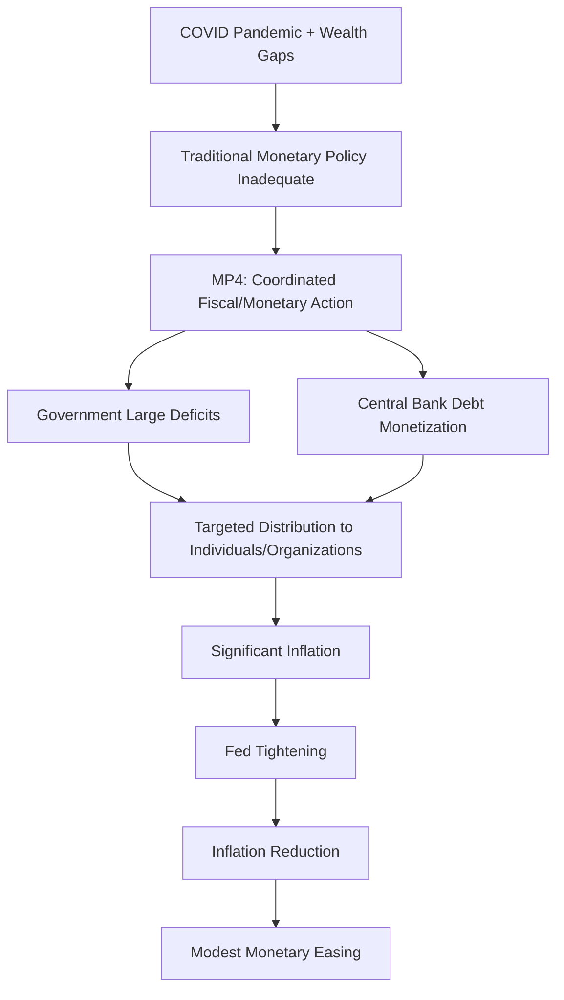
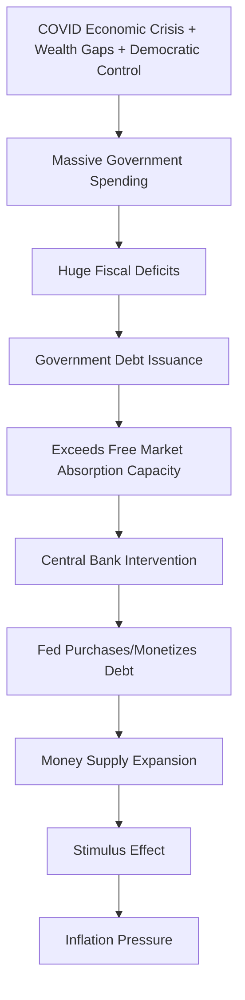
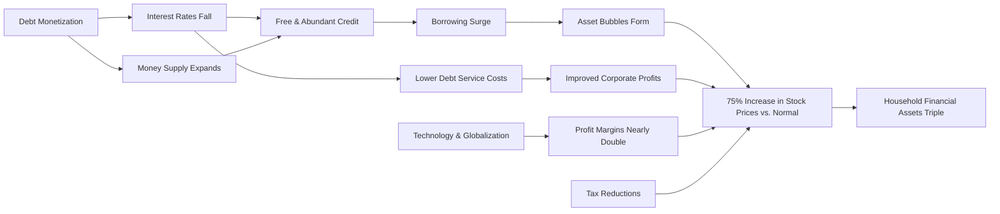
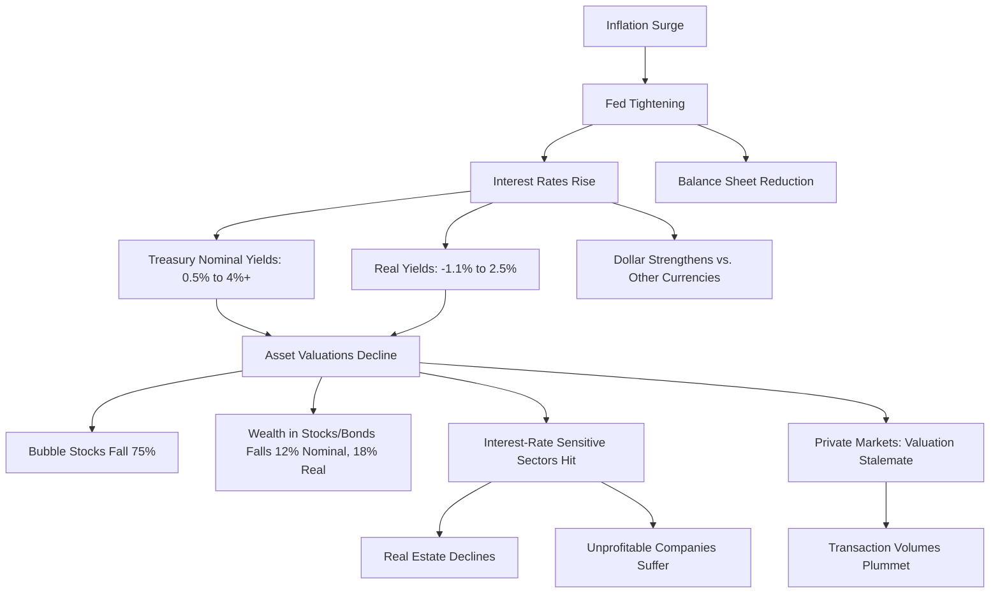
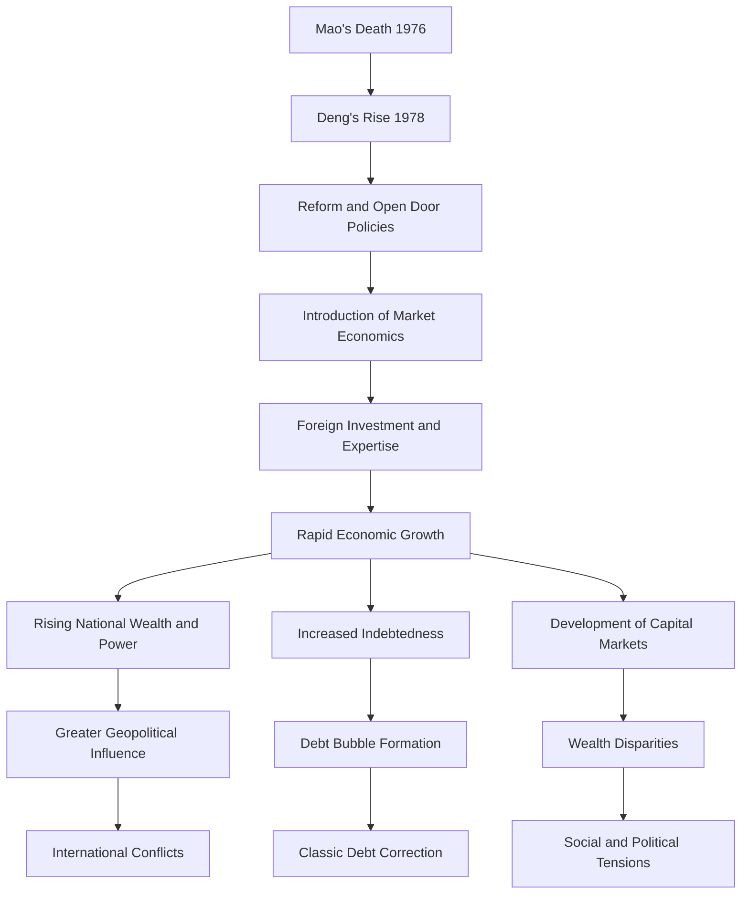
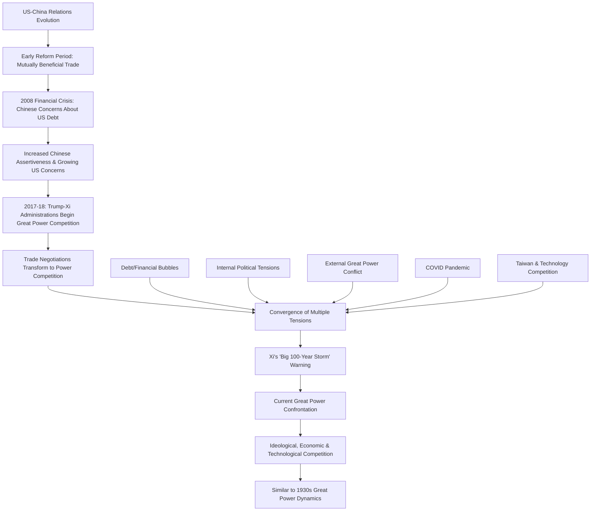
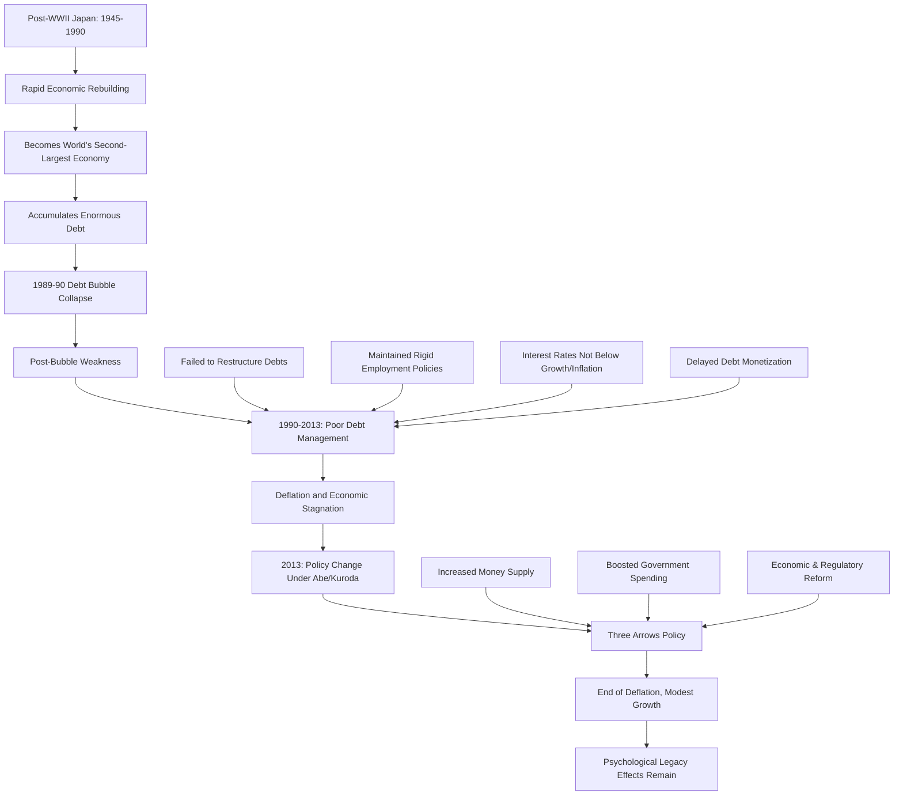

# Chapter 12: The History and Lessons from Phase 4, Since 2020—Pandemic and Big Fiscal Deficits Monetized (MP4)

The COVID pandemic of 2020 catalyzed a profound shift in monetary policy that I designate as Monetary Policy 4 (MP4). Despite longstanding principles in the US and many nations dictating that monetary policy should operate independently from fiscal policy—specifically to prevent the politicization and devaluation of currency—every sacrosanct rule eventually confronts reality and succumbs to pragmatic necessities as the Big Cycle progresses. MP4 represents this inevitable convergence: coordinated actions between central government and central bank, with governments running substantial deficits that central banks subsequently monetize.

This dynamic emerges when traditional tools—interest rate adjustments (MP2) and quantitative easing (MP3)—prove insufficient to ameliorate economic conditions for the majority population, and when market capitalism fails to distribute capital equitably. The free-market system inherently channels resources toward the financially advantaged—those holding assets and possessing borrowing capacity—while neglecting those with the greatest needs and vulnerabilities. This precise phenomenon materialized in 2008. The COVID pandemic necessitated more than mere monetary expansion; it demanded targeted distribution to specific individuals and organizations.

Throughout economic history, MP4 has manifested under similar conditions: acute economic distress coupled with pronounced wealth disparities that render interest rate adjustments or quantitative easing alone inadequate. This pattern typically emerges in the late stages of long-term debt cycles. In our current case, MP4 materialized in two substantial waves.

Below, I present updated versions of key charts previously examined. These visualizations effectively illustrate both recent developments since 2020 and contextualize these changes within the broader Big Debt Cycle. Observe how, within the comprehensive historical perspective shown in these charts, weekly, monthly, and even annual fluctuations appear relatively inconsequential. These visualizations should illuminate the more significant macroeconomic patterns at work.

## Debt Levels and Debt Service

The central government dramatically increased expenditures, distributing substantial funds that simultaneously increased its own indebtedness while alleviating private sector debt burdens.

## Monetary Policy and Central Bank Health

The Federal Reserve substantially expanded money creation and government debt purchases from 2008 until late 2021, when inflation concerns prompted tightening measures. This tightening represented a classic policy response to accelerating inflation. The subsequent interest rate increases generated losses on the Fed's bond portfolio, as illustrated in the right-hand chart.

## Interest Rates

While the interest rate increases were substantial, they remained proportionally less significant than the corresponding inflation surge (depicted in the left chart). Nevertheless, these increases elevated real bond yields to approximately 2%, which aligns with long-term historical averages (illustrated in the right and bottom charts).

## Breakdown of Interest Rates

The yield curve inverted, while the discounted 10-year inflation rate stabilized at approximately 2% as real yields approached 2%. These movements reflected the monetary tightening regime.

## The Wealth and Income Shifts

Labor's share of earnings continued its downward trajectory, reaching its lowest level since the 1950s. Concurrently, wealth and income proportions for Americans without college education continued to decline, exacerbating wealth and values disparities.

During this period, the American population and political landscape became increasingly polarized and extreme. The 2020 transition from Trump-led conservative Republicans to Biden-led progressive Democrats represented a significant political realignment.

I will now examine the developments between 2020 and the present (January 2025) in greater detail. Shifting perspective from the Big Cycle's long-term patterns to contemporary short-term cycles can feel disorienting—transitioning from macro-level decades to micro-level years and months might suggest we're moving from consequential phenomena to relatively trivial fluctuations. However, this perception would be erroneous. Both timeframes remain crucial since short-term dynamics influence long-term trends with equal significance as long-term patterns shape short-term movements.

This period's most defining feature was the pandemic, which triggered enormous stimulus measures and fiscal-monetary coordination (Monetary Policy 4). This produced inflation surges, market appreciation, and wealth redistribution—followed by substantial inflation that prompted tightening policies, which successfully moderated inflation and led to relatively modest monetary easing. Political polarization intensified throughout this period, with rightward political shifts ultimately restoring Trump to the presidency.

More specifically:

- This short-term cycle's easing phase began in 2020, catalyzed by: a) COVID-induced economic disruption, b) significant wealth disparities, and c) leftward political shifts via Democratic control of the presidency, House, and Senate. This easing manifested through massive government expenditures generating unprecedented fiscal deficits and debt issuance that far exceeded what free-market creditors would absorb, necessitating substantial central bank intervention—particularly from the Federal Reserve—to purchase and monetize this debt.

Other entities, including commercial banks and Japanese institutional investors, also acquired substantial US Treasury debt. This stimulative approach dramatically expanded money, credit, debt, and spending throughout the economy. This coordinated implementation of MP4 policies—allowing governments to borrow and allocate resources according to their priorities because central banks purchase debt with created money—is explained comprehensively beginning on Page 37 of my book _Principles for Navigating Big Debt Crises_, available as a [free PDF here](https://www.principles.com/big-debt-crises) for those seeking deeper understanding and historical parallels. This 2020-21 debt monetization exemplifies a recurring historical pattern, albeit unprecedented in our lifetimes.

- The 2020-21 debt monetization represented the fourth and largest significant debt monetization since the initial extensive quantitative easing in 2008 (itself the first such instance since 1933). Since 2008, nominal Treasury bond yields declined from 3.7% to merely 0.5%, while real Treasury bond yields shifted from +1.4% to -1%. Non-government nominal and real bond yields experienced even more dramatic reductions due to narrowing credit spreads. Money and credit became essentially free and abundant, creating an optimal environment for borrowers while severely disadvantaging lenders, triggering excessive borrowing and new asset bubbles.

My bubble indicator, which registered only 18% in 2010, escalated to 75% by late 2020, revealing bubbles in companies and assets characterized by minimal or negative profits, funded through equity issuance and/or debt financing based on future performance promises and speculative enthusiasm. This situation paralleled historical bubbles such as the Nifty Fifty (1970-72), Japan's asset bubble (1989-90), and the dot-com bubble (1999-2000). The interest rate collapse significantly elevated stock prices—by approximately 75% beyond what would have occurred without this decline (relative to pre-financial-crisis peaks). Additionally, technology adoption and globalization nearly doubled average profit margins, further boosting corporate profitability and valuations. Corporate and personal tax reductions provided additional support for asset prices. From the post-crisis nadir of 2009, the nominal value of US household financial assets (i.e., "paper wealth") tripled from $32 trillion to $99 trillion.

- The 2020 surge in money, credit, and debt generated substantial inflation, exacerbated by supply chain disruptions and external conflicts (representing the third of five major forces addressed later).
    
- This significant inflation spike prompted short-term cycle tightening by the Federal Reserve, which also allowed its balance sheet to contract through natural debt maturation rather than additional purchases. As the Fed (and other central banks) shifted from accommodative to restrictive monetary policies, nominal and real interest rates transitioned from extraordinarily favorable conditions for borrowers and detrimental circumstances for lenders to more normalized levels (e.g., 2% real bond yields).
    

Since the tightening cycle commenced, US Treasury nominal yields increased from 0.5% to over 4%, while real yields rose from approximately -1.1% to about 2.5%, adversely affecting most asset valuations, particularly for entities with weak or negative profitability and/or requiring new equity funding. Naturally, this transition especially damaged assets exhibiting bubble characteristics. My bubble indicator declined from a significant 75% to a more moderate 35% (no longer indicating a bubble), with bubble stocks in the index experiencing average declines of 75%. Consequently, the nominal value of wealth in stocks and bonds decreased by approximately 12% in the US, while the real value of wealth contracted by nearly 18%—the most substantial declines since 2009.

As cash transformed from "trash" to "attractive" with both short-term nominal and real interest rates becoming more appealing to lenders and less favorable to borrowers, and the yield curve inverted, these adjustments predictably reduced the present values of most investment assets' future cash flows while strengthening the dollar relative to currencies in countries where central bankers implemented slower tightening measures. In other words, the Fed's rapid policy shift elevated US dollar-denominated cash to relatively attractive levels compared to most assets, foreign currencies, and gold. This predictably damaged interest-rate-sensitive sectors including commercial and residential real estate, as well as unprofitable bubble companies in both public and private markets, though public equities suffered more severely. For example, the previously high-flying "FAANG" stocks and the technology-heavy NASDAQ declined approximately 45% and 33% from their peaks, respectively.

Non-public market assets—private equity, venture capital, and real estate—avoided comparable valuation adjustments due to reluctance to acknowledge depreciation. Write-downs and down-rounds became excessively painful for both companies and investment managers in these markets, creating a stalemate where sellers and buyers couldn't agree on valuations, causing transaction volumes to plummet. However, the economic impact was less severe than typical because the central government, rather than the private sector, absorbed the additional debt burden, and the central bank, not private investors, purchased the debt and sustained the resulting losses. Additionally, inflation affected wages and compensation as well as goods and services prices.

- Subsequently, inflation decreased while prices remained elevated, and the Federal Reserve and other central banks relaxed monetary policies, generally supporting asset valuations. Artificial intelligence and AI-focused companies emerged as the new investment frontier, projected to revolutionize the economy and quality of life similar to previous industrial and digital transformations, though simultaneously creating financial bubble conditions. These shifts produced significant performance disparities among stocks, companies, and countries.

Concurrently, global capital markets evolved with innovative investment products, albeit following familiar historical patterns. For example, we've witnessed the emergence of the private credit market—a contemporary iteration of the late 1970s/early 1980s junk bond market, though with greater customization, less securitization, increased illiquidity, and broader inclusion of early-stage enterprises. The substantial capital flows into this lending category helped maintain compressed credit spreads and finance more speculative ventures.

- Regarding internal conflicts surrounding wealth and values between right-wing and left-wing populists, tensions intensified across most democracies, most notably in the United States. The divide between political right and left became increasingly extreme, while substantial price increases resulting from fiscal and monetary stimulation by the US central government and central bank significantly elevated prices of goods, services, and financial assets.

In the 2024 election, these inflationary pressures combined with other factors such as President Biden's diminished acuity contributed to a decisive victory for Donald Trump and the Republican Party—representing rightist/capitalist/social conservative interests—over Kamala Harris and the Democratic Party—representing leftist/socialist/social liberal perspectives. This outcome granted Trump a mandate to fundamentally restructure the central government and broader society while preparing for potential conflict with China and its allies. The major domestic unrest that would likely have followed a narrow Trump defeat was averted.

This brings us to our current position.

## The Five Big Forces: Debt, Civil War, International War, Acts of Nature, and Technology

Daily news consistently centers on these five forces. Connecting historical developments to present circumstances reveals their evolution according to the Big Cycle template comprehensively explained in my book [_Principles for Dealing with the Changing World Order_](https://economicprinciples.org/), my [40-minute video](https://www.youtube.com/watch?v=xguam0TKMw8), and my [5-minute video](https://www.youtube.com/watch?v=BB2r_eOjsPw).

Government debt clearly represents a substantial and growing concern. The thus-far nonviolent civil conflict between rightists/capitalists/MAGAs and leftists/socialists/communists/progressives continues intensifying, with the 2024 US election resulting in a rightist/capitalist/MAGA victory over leftist/socialist/communist/progressive forces. Simultaneously and relatedly, international tensions—particularly between the United States with its allies (the allied powers) and China with its allies (the axis powers)—are escalating. Similarly, natural forces, primarily climate change, are intensifying, while technology, especially artificial intelligence, will exert profound yet unpredictable impacts, both beneficial and detrimental.

These issues are fundamentally interconnected. Most critically, America's internal divisions and external conflict with China will be influenced by technological competition and economic warfare (e.g., necessity for increased military expenditures). For previously articulated reasons, this situation bears striking resemblance to the 1936-38 period.

Given China's significance, I will briefly review its entire Big Cycle since 1945 (marking the beginning of the current world order) to 1949 (when its current domestic order was established). Subsequently, I'll examine Japan's Big Cycle with particular emphasis on its debt cycle dynamics, as this case study offers valuable insights and lessons. I will then analyze what key metrics and calculations reveal about potential future developments, concluding with recommendations.

# Chapter 13: China's Big Cycle from 1945-49 Until Now in a Very Tiny Nutshell

_This chapter requires approximately fifteen minutes to read and explains the progression of China's Big Cycle up to the present moment, providing valuable context for interested readers._

To contextualize China's history within its Big Cycle framework, I will summarize developments since the establishment of the new world order and China's domestic order during 1945-49, with brief reference to preceding conditions.

## Before 1945

To examine China before our current Big Cycle, consider the following chart illustrating China's Big Cycles since 600 CE. This measure estimates China's relative strength using multiple indicators as detailed in _Principles for Dealing with the Changing World Order_. My analysis of these cycles reveals consistent patterns with the Big Cycle template referenced throughout this study and comprehensively explained in that book.

The chart below depicts China's Big Debt Cycles since 1865—26 years after the Century of Humiliation began—until present day. This 110-year period of humiliation (as Chinese historians designate it) represents an era when foreign powers exploited and subjugated China, beginning with the First Opium War in 1839 and concluding with Mao Zedong and the Chinese Communist Party assuming power and establishing the People's Republic of China in 1949. This debt cycle illustrates how substantial debts accumulated, were subsequently eliminated, and rebuilt again. Characteristically, the debt erasure coincided with internal and external conflicts (1945-49), followed by a new order and renewed debt accumulation. Throughout most of this period, however, Chinese currency and debt were not considered reliable stores of value.

While I won't delve extensively into China's previous Big Cycle encompassing the Century of Humiliation, I must acknowledge its profound influence on Chinese leadership perspectives regarding foreign powers and current domestic conditions. This historical period remains deeply embedded in Chinese leaders' consciousness and has fostered a belief that foreign powers' current economic competitions parallel their approaches during the Century of Humiliation.

Specifically, Chinese leadership interprets American hegemonic actions as attempts to control the world order for self-interest and contain China within its regional sphere. Most significantly, they perceive America's Taiwan stance as more intrusive than Americans considered Russian influence in Cuba during the 1960s, because from China's perspective, Taiwan has been "indisputably and consistently" recognized as Chinese territory by all major world powers since World War II. Chinese leaders unequivocally expect to eventually incorporate Taiwan and portions of the South China Sea under their control. Conversely, most Americans view China as an expanding threat to the United States and the existing US-led world order, perceiving Chinese leadership as ideologically threatening communists who autocratically control their population and engage in ideological warfare against America's capitalist, democratic, Abrahamic (Judeo-Christian-Islamic) system. Some policymakers in both Washington and Beijing interpret this conflict as the final and most consequential ideological-economic-military confrontation. This relationship is inherently complex with multiple perspectives that I won't elaborate on further. I simply wish to emphasize that Chinese leaders' historical understanding significantly influences their thinking and actions. More broadly, they demonstrate acute awareness of big cycles and the five major forces I've described.

The most critical developments are China's unprecedented rise to great power status—achieving nearly comparable strength to the United States—and the emergence of great power competition between these nations. The following charts illustrate my comprehensive assessment of relative powers since 1825 and US-China conflict metrics since 1963. The first chart demonstrates China's dramatic power decline during the Century of Humiliation followed by remarkable resurgence, approaching US-level capabilities. This progression has precipitated classic great power rivalry between the US and China and their respective allies. For detailed metrics underlying China's assessment, visit [www.economicprinciples.org](http://www.economicprinciples.org/).

Here is my concise overview of China's development since 1945.

In **1945**, World War II concluded, establishing the current world order, and in 1949, China's civil war ended, creating the current domestic order.

**From 1949 until 1976, China functioned as an isolated communist state governed by revolutionary leader Mao Zedong and his chief administrator, Zhou Enlai.** During this period, China recovered gradually from World War II and its civil war, hindered by rigid, unproductive communist economic policies, strict controls ensuring Mao and the Chinese Communist Party's dominance, and isolation from the international community. Typically in Big Cycles, victorious civil war factions suppress opposition to consolidate power due to overthrow concerns. In Chinese dynastic history, covert and violent leadership overthrows occur with such frequency that they represent a perpetual threat. This pattern persisted throughout Mao's lifetime. Mao confronted numerous adversaries, primarily domestic capitalists and, after the late 1950s, the Soviet Union externally. Marxist-Leninist communist principles and rejection of "foreign devils" shaped China's policies during 1949-76. Under Mao's leadership, China's development lagged behind global progress, causing significant hardship, particularly during the Great Leap Forward and Cultural Revolution. Regarding foreign relations, Mao's primary concern became the increasingly threatening Soviet Union, especially during the 1960s and 1970s. As history consistently demonstrates—reflected in the adage "the enemy of my enemy is my friend"—common adversaries unite nations, exemplified here by the Soviet Union bringing together the United States and China. This rapprochement facilitated Henry Kissinger's and subsequently President Nixon's visits to China. Through personal relationships with both Henry Kissinger and Ji Chaozhu, I gained valuable insights into both perspectives, which I'll share in a forthcoming book on China. Suffice it to say that mutual interests and a common enemy facilitated their 1972 engagement.

**Mao and Zhou died in 1976.**

**As described in Chapter 10, Deng Xiaoping assumed power in 1978 and fundamentally transformed Chinese society through "reform" and "open door" policies, introducing a market-based economic system that welcomed foreign expertise and capital.** He distinguished this new approach with statements like "it is glorious to be rich" and when questioned about adopting more market-capitalist methods, responded, "It doesn't matter whether a cat is black or white as long as it catches mice." This acknowledged that market-capitalist systems effectively "catch mice" (generate wealth) and established the priority sequence: accumulate wealth and power first, then address "common prosperity." **These policies facilitated China's remarkable economic advancement, transforming it from an impoverished, weak nation into a formidable power.**

**I witnessed this transformation firsthand from 1984 until present, gaining insights into Chinese leadership perspectives through direct engagement.** My involvement with China began in 1984 as a guest of CITIC, then the only "window company" permitted to engage with the outside world through capitalist mechanisms. They requested my expertise regarding global capital markets. While China lacked significant financial resources at that time, my initial curiosity evolved into sustained engagement because I valued the people, culture, and opportunity to positively influence the country's markets and economic development. This provided invaluable learning experiences and considerable fulfillment, so extensive that comprehensive description would constitute an excessive digression. **Through this lens of personal experience, I observed this powerful combination of economic reform and international engagement transform China from:**

**1) a conventional unproductive communist country to** **2) an effective "socialist market economy" to** **3) the development of capital markets and Chinese-style capitalism to** **4) the formation of a classic debt bubble culminating in** **5) a classic debt correction characteristic of systems where debt is denominated in domestic currency and primary creditor-debtor relationships exist between citizens.**

More specifically, China experienced a quintessential upward Big Cycle trajectory that elevated its population from extreme poverty to substantially improved living standards, with many individuals and the nation as a whole achieving unprecedented prosperity and influence. Simultaneously, increased indebtedness and capital market development created significant wealth disparities and bubble conditions. **I witnessed China's progression from confronting poverty and geopolitical weaknesses to implementing market/debt reforms and open-door policies that generated extraordinary wealth and geopolitical power, to managing these newfound capabilities amidst widening wealth and opportunity gaps and escalating domestic and international tensions.**

**During the Deng era, I observed the Big Cycle unfold firsthand as follows:**

- **China leveraged its inexpensive labor and productivity gains to provide globally competitive manufactured goods.**
    
- **The US and most developed economies welcomed affordable Chinese manufacturing, especially as China reinvested earnings by purchasing American debt instruments, financing American consumption of Chinese products, which produced the following effects:**
    
- **China's income, wealth, and power expanded dramatically while the US accumulated excessive debt.**
    
- **The 2008 financial crisis placed China in a precarious position, uncertain whether substantial US debt obligations would be honored and questioning America's financial stability.** I participated directly in these discussions and must acknowledge China's gracious and understanding approach to the debt crisis.
    
- **In 2008, the newly formed Group of 20 (G20), established to better represent global economic power distribution than the G7, convened its inaugural summit addressing the global financial crisis. They agreed on aggressive stimulus measures, prompting China and virtually all major economies to expand credit availability, which improved conditions but widened wealth gaps and increased debt-to-income ratios.** As previously explained, in the US, expanding wealth disparities and economic hardship among disadvantaged populations fostered resentment toward China for manufacturing job losses. The most severely affected American workers—non-college-educated men—became Donald Trump's core constituency. **Concurrently, American corporations complained about unequal competitive conditions in China and intellectual property appropriation.**
    
- **China's capabilities and influence continued expanding, providing resources for military development, geopolitical leverage, and technological advancement, which fostered greater assertiveness and perceived threats. In 2009, China claimed territorial boundaries extending far beyond other nations' recognized limits, citing historical precedent demarcated by a nine-dash line.** Despite the Permanent Court of Arbitration's 2016 ruling against China's claim, this territorial dispute persists today.
    
- **President Xi and his leadership team assumed power in 2012. The new administration's primary objectives focused on economic reform and corruption elimination.** Due to my expertise and established relationships, I participated in discussions during the third plenum (the new government's strategic planning session following leadership appointments). I experienced an exceptionally open, collaborative environment with transparent exchange of ideas regarding critical issues. Economic reform entailed modernization toward market-oriented mechanisms. For instance, during this period, six major banks primarily lent to state-owned enterprises with implicit government guarantees backed by monetary sovereignty, while small and medium enterprises received minimal financing. Leadership sought to address this imbalance by developing capital markets to improve access to credit and investment opportunities. My close involvement provided insight into the thinking and implementation process. During most of Xi's initial five-year term, I observed: a) receptiveness to external perspectives, b) determined commitment to further market-oriented economic reforms and capital market development, and c) aggressive anti-corruption initiatives. Senior leadership appointments reflected these priorities. Naturally, implementation strategies generated debate, with some benefiting from these changes while others experienced adverse effects, creating factional divisions. I witnessed the following developments:
    
- **Late in Xi's first term, political power consolidated around him through a "core leadership" initiative.** American political maneuvering appears mild compared to Chinese political dynamics. This became particularly evident during leadership transitions between Xi's first and second five-year terms.
    
- **Until this juncture, China achieved remarkable progress—by many metrics, the greatest in human history. Since my initial engagement with China in 1984, per capita income increased twenty-fold, average life expectancy extended by twelve years, and poverty rates plummeted from 81% to less than 1%.**
    
- **In 2015, Xi introduced his 2025 strategic plan outlining China's aspirations to achieve dominance in specific industries. Chinese leadership viewed this as aspirational while Americans perceived it as threatening. China's expanding global trade presence, increasing prosperity, assertive geopolitical positioning, and intellectual property acquisition practices heightened American apprehension. During this period, Americans increasingly attributed their economic challenges to Chinese competition and viewed China as an escalating threat.**
    
- **Middle-class job losses in the US, attributed to Chinese imports, combined with China's growing international assertiveness, shifted American sentiment toward China from positive to negative.**
    
- **When President Trump assumed office in 2017 and President Xi began his second term in 2018, great power competition intensified significantly**, beginning with trade negotiations that evolved into power demonstrations and cold war dynamics. Then in 2019-20, COVID emerged. Simultaneously, China's debt bubble and wealth disparities expanded while US relations deteriorated, creating a classic convergence of debt/financial, internal order, external order, and natural forces into a volatile combination. Additionally, the Taiwan question remained (and continues as) a major contentious issue because China anticipated fulfillment of One China unification commitments while independence movements appeared to gain momentum. This tension intensified because Taiwan produced (and continues to produce) most advanced computer chips globally, with whichever nation controlling this technology effectively commanding the world's most powerful technological capabilities. Observing these escalating domestic and international tensions, combined with his historical understanding, President Xi warned of an approaching "big 100-year storm."
    
- **In 2020, substantial portions of China implemented COVID restrictions, generating domestic discontent regarding containment strategies.**
    
- **In 2021, midway through Xi's second term, China's domestic debt bubble collapsed. Xi emphasized "common prosperity" and expressed disapproval of wealthy business leaders' arrogance and influence over governance, prompting seemingly arbitrary interventions inconsistent with established rule of law and property protection principles that investors considered essential.**
    
- **At the commencement of President Xi's third term in October 2022, China's leadership shifted from reform-oriented globalists to loyal communist nationalists implementing tighter opposition controls, and transitioned from highly market-oriented policies with flourishing capital markets toward more Mao-influenced communist approaches as domestic conflicts and international power competition intensified.**
    
- **Currently, China represents a nation experiencing: 1) significant debt crisis while reverting to traditional communist economic policies alongside continued remarkable advancements, while 2) managing increased internal tensions through stricter, autocratic presidential directives, while 3) navigating intensified conflict with the United States amidst profound global transformations that China increasingly influences, while 4) confronting climate change likely to substantially impact China, while 5) competing for technological supremacy in a contest neither China nor the United States can afford to lose.**
    
- **Now, the Trump administration has returned to power in the US, which similarly faces: 1) substantial debt challenges, while 2) confronting increased internal divisions leading to stricter, semi-autocratic presidential policies, while 3) experiencing heightened tensions with China and significant world order transformations with the US under Trump transitioning from global leadership to "America First" nationalist participation in the evolving international system, while 4) addressing climate change likely to substantially impact American interests, while 5) competing for technological dominance in a race neither China nor the United States can afford to lose. Consequently, we are witnessing a confrontation between these superpowers, with allies aligning behind their respective ideologies, resembling mid-to-late 1930s conditions when the world occupied a similar Big Cycle phase.** Future developments in the US, China, and globally will test the relative capabilities of these great powers and their contrasting approaches and systems. These two superpowers now engage in conflict that, fortunately for humanity, remains non-military. This promises to be history's most consequential great power competition. A senior Chinese official once explained to me the fundamental difference in conflict approaches between these civilizations; he described Western nations following a Mediterranean confrontational strategy, while China employs the subtler, indirect approaches outlined in Sun Tzu's _The Art of War_, written approximately 2,500 years ago. Throughout my extensive engagement with China, I've observed the enduring influence of such timeless principles on Chinese leadership's domestic governance and international relations.
    

**In summary, I'll briefly review China's experience through my Five Big Forces framework:**

1. The Big Debt Cycle force drove China's debt expansion relative to income, though not relative to liquid assets until 2009 (following the global financial crisis). Subsequently, particularly local government, corporate and real estate debt grew into a bubble that burst in 2021, initiating deleveraging. Like Japan, most Chinese debt is denominated in domestic currency, enabling potential implementation of a "beautiful deleveraging," which Japan failed to execute. China's ultimate management of this challenge remains uncertain, though current indications suggest slow response to these challenges, placing China in the late Big Debt Cycle stage most comparable to Japan's 1990 position.
    
2. The internal conflicts and internal politics force prompted government tightening of controls, creating an environment of heightened apprehension that has impeded decision-making, dampened economic activity, and restricted capital and human flows, contributing to Chinese economic deceleration. Policy orientation has regressed approximately halfway toward Maoist-Marxist communist approaches.
    
3. The external conflict force generated classic great powers competition with the United States, disrupting trade, capital, and human exchanges while necessitating increased military preparation and risk tolerance.
    
4. The acts of nature force manifested through the COVID pandemic beginning in late 2019 and continuing through 2022, straining public confidence in leadership responses and contributing to increased government controls. China has also leveraged its exceptional innovation capacity, state-directed economic policies, and advanced manufacturing capabilities to achieve unprecedented progress in solar and wind power technology, becoming the world's most cost-effective producer in these sectors—a remarkable achievement deserving separate discussion.
    
5. The technology force has driven both China and the US toward numerous technological breakthroughs, particularly in advanced AI, with China apparently losing ground to the US in cutting-edge semiconductor development while excelling in other domains, most notably advanced manufacturing.
    

In summary, recent years have seen four of the five major forces (debt/economic, internal conflicts, international conflict, and natural phenomena) increasingly threaten China's stability, while the technology force presents mixed outcomes with significant advances coupled with apparent setbacks in certain existentially important sectors. Inevitable further testing of US-China relative powers and their contrasting approaches to a) capitalism and democracy versus b) communism and autocracy seems inevitable.

## China's Big Debt Cycle in Some Charts

The following charts effectively illustrate China's debt situation, though I'll refrain from detailed analysis with commentary because comprehensive assessment would constitute excessive digression. Furthermore, not all obligations are accurately recorded, so these visualizations provide general indications rather than definitive measurements.

As demonstrated, China has reached the cycle phase where non-central-government debt burdens have become excessive and problematic, necessitating central government and central bank intervention. Fortunately, most debt is denominated in local currency with primarily domestic creditor-debtor relationships, providing the central government and central bank substantially greater management flexibility than otherwise possible. However, China's currency (renminbi) lacks widespread reserve currency status and therefore doesn't function as an effective store of value. Ideally, Chinese policymakers would possess both capability and resolve to rapidly implement a "beautiful deleveraging." However, as previously explained, such adjustments initially generate significant discomfort by causing major wealth redistributions and, if improperly balanced, can merely shift debt burdens, exacerbate long-term central government obligations, and/or severely undermine currency value, potentially damaging capital markets and consequently the broader economy. The Japanese experience, examined in the next chapter, offers valuable lessons for Chinese authorities (and other policymakers, investors, and business leaders).

As illustrated below, Chinese debt levels continue reaching new highs despite suboptimal economic performance. This dynamic parallels Japan's experience over recent decades.

The upper-left chart below shows 10-year bond yields relative to reported one-year and three-year average headline inflation figures. Actual deflation in consumer products and investments has exceeded these metrics. The bottom chart indicates nominal government bond rates approaching zero, suggesting alternative "non-conventional" fiscal and monetary policies will likely become necessary. Additionally, as shown in the upper-right chart, real bond yields approximate 0.5%, making them: a) relatively unattractive under normal conditions but b) still comparatively attractive within a deflationary economy with declining asset values, yet c) relatively unappealing compared to other countries' rates, particularly US dollar-denominated bonds.

As demonstrated below, the yield curve (as of January 2025) exhibits inversion, making cash relatively attractive during a period when this preference encourages liquidity hoarding, creating "pushing on a string" conditions that I previously addressed in Chapter 1. Additionally, various liquidity measurements (total social financing, money supply, total financial sector loans) continue expanding without stimulating real economic activity revival—another indication of "pushing on a string" dynamics.

# Chapter 14: The Japanese Case and the Lessons It Provides

_This chapter will particularly interest those studying Big Debt Cycle mechanics but may hold less appeal for others. It demonstrates how a heavily indebted reserve currency nation managed its obligations, referencing the previously described template. Most significantly, this Japanese case study illustrates the Big Cycle's classic progression in Japan, with cause-effect relationships functioning as predicted. This analysis reveals that for 23 years, Japanese policymakers implemented precisely the opposite approach to what constitutes a beautiful deleveraging—after their debt bubble collapsed, they delayed debt restructuring for nine years and failed to maintain interest rates below inflation and nominal growth rates for 23 years, producing deflationary depression until 2013, when fiscal stimulus accompanied substantial debt monetization and significant depreciation of debt assets and currency. While this Japanese case study presents a fascinating narrative of economic mechanisms for those interested, its technical nature means casual readers might prefer to focus on the bolded highlights, requiring only about five minutes._

Japan's narrative, like China's, represents a fascinating historical progression extending beyond the current Big Cycle that began in 1945. To properly contextualize Japan's history within its Big Cycle framework, I'll summarize developments since the establishment of the new world and domestic orders in 1945, with brief reference to pre-1945 conditions. As with China, Japan's post-1945 narrative would lack essential context without at least cursory examination of the preceding century's Big Cycle dynamics.

In brief, Japan, similar to China, remained isolated from global engagement until foreign powers—specifically US Commodore Matthew Perry's American fleet—demanded trade relations. The superior foreign military capabilities precipitated the collapse of Japan's 250-year Tokugawa (family) shogunate (government). Recognizing foreign, modernized approaches' advantages, this regime was replaced in 1868 by a new government that substantially adopted Western models (paralleling Deng Xiaoping's reforms). This constitutional monarchy under Emperor Meiji modernized Japan by implementing Western educational, economic, and military systems. These reform and opening policies that emulated more advanced Western powers, similar to Deng's China, transformed Japan into a formidable power. Japan subsequently defeated two regional rivals—China (1894-95) and Russia (1904-05)—followed by Korean annexation (1910). During World War I (1914-18), Japan opportunistically seized German Asian territories. In the 1930s, Japan invaded Manchuria (1931) and expanded further into China (1937). Subsequently, Japan entered a geopolitical conflict with the United States characterized by trade and sanction disputes resembling current US-China tensions, with oil then functioning similarly to semiconductors today. This culminated in Japan's attack on Pearl Harbor, leading to war with the United States that Japan lost when America developed revolutionary technology with both peaceful and military applications—nuclear power. Japan's defeat destroyed all Japanese currency and debt, and the United States occupied and reconstructed Japan from 1945 until 1952.

The chart below illustrates total debt-to-GDP ratios since 1870, revealing both the pre-1945 Big Debt Cycle and subsequent patterns. Note the substantial debt accumulation during 1930-45 before and during the war, followed by debt elimination that maintained low levels until 1970, succeeded by significant debt bubble formation leading to 1989-90 correction, and subsequent ratio increases until recently. These visualizations capture Big Debt Cycles since 1870, with short-term debt and economic fluctuations imperceptible at this scale.

## Since 1945

Briefly, from 1945 through 1990, Japan rebuilt itself to become the world's second-largest economic power while accumulating enormous debt that collapsed in 1989-90, significantly weakening Japan thereafter. Following World War II and with American approval, Japan opted against military expansion, choosing instead to function as an American protectorate. I'll now concentrate on the post-debt-bubble period until present because this represents the most relevant timeframe for understanding the Big Debt Cycle phase central to this study. The lessons from examining this portion of the Big Debt Cycle provide valuable insights for understanding other cases—particularly current conditions in the United States, China, and Europe. Since my focus concerns the deleveraging component of the Big Cycle, I'll bypass the 1944-90 period and concentrate on post-1990 developments.

## The Big Debt Cycle Since 1990

The Japanese government's management of its debt crisis from 1990 until 2013 exemplified precisely what not to do. It implemented the exact opposite of recommendations for executing a beautiful deleveraging, despite possessing the capacity for effective implementation since almost all debt was denominated in local currency and most challenging debtor-creditor relationships existed between Japanese entities, plus Japan maintained net creditor status globally. Specifically, policymakers failed to restructure debts, allowing obligations to linger on bank and corporate balance sheets, creating "zombie institutions"; they maintained rigid employment and cost structures, preventing effective cost reduction and adaptation; they failed to establish interest rates below both nominal growth rates and inflation; and they delayed debt monetization until after deflation materialized and interest rates approached zero in 1995. For nearly two decades, fiscal adjustments, free-market policies, monetary stimulus, and debt purchases remained woefully inadequate to engineer effective deleveraging. Consequently, until 2012, Japan experienced persistent deflation and economic stagnation as institutions and individuals lacked necessary financial conditions to overcome debt burdens. The Japanese government postponed addressing non-performing loans until 1999 (nine years after the debt bubble's collapse) when authorities finally compelled banking system debt restructuring and injected substantial capital into banks, and they failed to monetize debt and maintain interest rates significantly below nominal growth and inflation rates until 2023. Additionally, Japan's demographic challenges intensified with its aging population (e.g., in 1990, 12% of the population exceeded age 65 with 69% working-age, while currently 29% exceed age 65 with only 59% working-age).

Fiscal and monetary strategies fundamentally and appropriately transformed when Bank of Japan Governor Kuroda and Prime Minister Abe assumed leadership in late 2012/early 2013 and initiated their "three arrows" policy to: 1) expand money supply, 2) increase central government expenditures, and 3) implement economic and regulatory reforms enhancing Japanese competitiveness—representing classically optimal approaches for counteracting deflationary, recessionary forces. Consequently, from 2013 through 2019, Japan avoided deflation while achieving modest positive growth (0.9% annually) and commencing recovery, though deflationary psychological conditions persisted. The psychological aftermath of 23 years of debt-induced depression has produced enduring negative effects on national vitality and dynamism that characterized pre-1990 Japan and numerous historical periods.

Since 2013, extraordinary debt monetization and fiscal deficit stimulus (averaging 5% of GDP) accompanied massive central bank Japanese yen debt purchases (BoJ now holds government bonds exceeding 90% of GDP), driving interest rates 0.9% below nominal growth and 1% below inflation on average, while depreciating the yen—all generating substantial stimulus. Combined lower interest rates and currency devaluation rendered Japanese government bonds terrible wealth preservation vehicles, losing 45% relative to US bonds and 60% compared to gold. These and complementary measures maintained average interest rates approximately 2.2% below US rates and depreciated the currency by average annual real terms of 5.5% against USD. Specifically, since 2013, Japanese government bonds' cumulative returns compared to US government bonds declined 45%, primarily due to currency depreciation, since lower Japanese bond yields were entirely offset by price appreciation (roughly +20%) resulting from declining Japanese yields. Simultaneously, Japanese inflation averaged only 1.1% annually compared to US inflation of 2.7% annually due to domestic deflationary pressures. The principle "avoid government bonds during such periods" should resonate clearly.

Let's examine these developments more closely.

Since 2013, despite modest average annual wage increases of 0.8% in yen terms, substantial yen depreciation combined with greater wage growth in other nations enhanced Japanese competitiveness. For example, Japanese worker costs relative to American workers declined 58% since 2013. Similarly, other domestic Japanese goods and services became significantly less expensive relative to international counterparts, improving Japanese competitive positioning. These changes appear in the charts below.

These low interest rates dramatically reduced debt service expenses—since 2013 Japanese interest debt service declined over 50% (and has decreased over 65% since 2001), substantially facilitating debt servicing.

Nevertheless, Japanese debt during this period increased by nearly 10%. To neutralize this effect, the Japanese central bank acquired over half of all government debt and absorbed associated debt service costs, which it monetized. Interest rate reductions orchestrated by the BoJ also contributed to debt relief (though this benefit largely preceded Governor Kuroda's appointment, as short-term rates had already reached zero).

The following charts illustrate these trends. The bottom left demonstrates substantial reductions in interest payments from government to public, while other charts show contributing factors: central bank purchases and significant declines in interest and principal obligations.

Remarkably, the massive debt expansion during this period coincided with improving Japanese central government balance sheet conditions. Net assets (government assets minus liabilities) have improved 20% in dollar terms compared to 2013 because the Bank of Japan accumulated dollar reserves (primarily during 2001-12) and Japan's dollar-denominated debts increased less substantially due to yen depreciation.

Who benefited and who suffered? Unquestionably, Japanese debt holders, including the Japanese central bank, experienced the greatest losses. Japanese bondholders lost 6% in real terms (reflecting generally negative real yields), 45% compared to holding US bonds instead, and 60% relative to traditional "hard money" gold. Below is a chart illustrating real returns for Japanese investors holding JGBs (in local currency) and their performance relative to US bonds and gold.

Concurrently, the BoJ's balance sheet deteriorated significantly. These losses would become enormous if Japanese real and nominal bond yields rise to more reasonable levels (e.g., 2% and 3% respectively).

For instance, if Japan experienced a 3% real interest rate increase (from -0.3% to 2.7%):

- The BoJ would face a 30% of GDP mark-to-market loss on bond holdings and confront seriously negative cash flow approximating -2.5% of GDP.
    
- The government would see deficits expand from roughly 4% of GDP to approximately 8% of GDP over the next decade due to increased interest expenses (excluding any outlays covering central bank losses). Government debt would exceed its post-WWII peak, rising from 220% to 300% of GDP over the next two decades.
    

- The combined central bank and government annual cash flow requirement would approximate 5-6% of GDP—an enormous sum. This would necessitate debt issuance, money creation, and/or deficit reduction. If financed through central bank monetary creation, this would constitute another quantitative easing round in terms of money supply expansion, excluding additional printing needed to offset private sector selling.
    
- Resolution would require even greater debt write-downs and currency devaluations—with Japanese citizens becoming relatively poorer—until Japan achieves sufficient competitiveness to initiate a new cycle.
    

Key non-tradable goods—local wages, local services, local housing—have experienced negligible price increases in yen terms and significant deflation in global currency terms since 2000. Rent affordability (rent relative to wages) has remained essentially unchanged. This persists despite tradable goods and commodities increasing substantially due to currency depreciation. A standard convenience store boxed meal previously required 10 minutes of labor to afford, now requires 16 minutes (increasing 60%+)—representing approximately 2% annual inflation for that item (in wage terms). Meanwhile, Japanese worker competitiveness has reached unprecedented levels.

Nevertheless, Japan has experienced dramatically lower dollar-denominated incomes, making imported products substantially more expensive. Using the most comparable metric (dollar GDP per capita), Japanese individuals formerly exceeded US individuals in wealth, but now they are approximately 60% poorer. This reality becomes immediately apparent to any Japanese citizen traveling internationally.

For an alternative perspective on winners and losers, examining granular Japanese price changes provides insight into everyday earning, spending, and saving experiences. The following table provides extensive details, but in summary:

- Since 2000, the yen has depreciated 30%. American investors maintaining yen exposure versus dollars while earning dollar interest rates lost 84%.
    
- Returns for holding unhedged Japanese bonds versus US bonds performed marginally better (though still severely negative, declining approximately 70%) and slightly better (though still significantly negative) for unhedged Japanese equities versus US equities (declining approximately 67%).
    
- Meanwhile, Japanese prices (aggregate CPI) increased 10%—substantially less than American prices, which rose 90%.
    
- Concurrently, all fiat currencies devalued against physical goods. The dollar has depreciated approximately 50% over the past 24 years.
    
- While total average inflation appears similar across major categories, inflation composition differs dramatically. Japan experienced deflation in non-tradables—particularly housing and labor—while tradable goods prices (internationally purchasable items like electronics, toys, oil, etc.) surged, with certain key tradable commodities increasing 3x+ in yen terms.
    
- Non-tradables remained essentially flat while tradable commodities increased 2-10x (averaging 3x).
    

- These patterns largely reverse pre-bubble trends (1980-90), when robust growth and strong capital inflows generated both significant non-tradable inflation (+40%) and yen appreciation (+70%). These shifts reflect Japan's Big Cycle transformations.

The following charts illustrate typical Japanese worker experiences. Over the past 25 years, average worker wages remained relatively constant in yen terms at approximately 400,000 yen monthly, but declined substantially in dollar and global currency terms. While the typical Japanese worker previously earned approximately $3,500 monthly equivalent, they now earn about $2,500. In gold terms, they formerly earned 13 gold ounce equivalents monthly; now they earn approximately 1 ounce.

The impact becomes evident when examining real prices of items combining commodities with substantial domestic labor components. Vehicle cost data fluctuates considerably, but generally a domestically manufactured automobile previously required eight months of labor to afford, now requiring nine months. A convenience store boxed lunch previously required 10 minutes of work, now requires 16 minutes (increased 60%+). A theme park visit formerly cost one-third of a day's labor, now requires half a day.

These charts reflect dramatic transformations that occurred and will likely continue due to the previously described typical mechanical progression of the Big Debt Cycle in countries with substantial debt denominated in domestic currency and reserve currency status.

Remarkably during this period, Japan experienced no significant internal or external conflicts, though Japan is currently preparing for potential conflict with China (despite preferring to avoid it) as America's principal regional ally.

## How Did Japan Reach This Position?

I want to highlight six dynamics that shaped Japan's current situation, determining winners and losers. The process unfolded as follows:

1. Government deficit spending flooded the private sector with liquidity, facilitating private sector deleveraging.
2. The central bank monetized debt, maintaining low long-term interest rates, reducing debt service costs, and stimulating demand. Government debt burden excluding central bank holdings began declining as percentage of GDP.
3. The resulting currency depreciation functioned as an implicit tax on foreign investors holding unhedged domestic bonds and domestic investors without international diversification, while reducing government debt burden value measured in foreign currencies and gold.
4. Domestic savers experienced similar taxation, though less severely because while their international purchasing power declined, domestic purchasing power remained relatively stable.
5. The country gained competitiveness, with both assets and production factors becoming more affordable.

More specifically, this progressed as follows:

**Dynamic 1: Public sector deficit spending floods private sector with liquidity, enabling private sector deleveraging.**

The following chart illustrates this dynamic, with public sector debt escalating from approximately 1990 to 2020 during private sector deleveraging. Following this government leveraging, Japan maintained the highest government debt levels among major economies. Numerous historical cases demonstrate governments struggling with debt burdens. Japan managed this challenge because of the second dynamic.

**Dynamic 2: The central bank monetizes debt, maintaining low long-term interest rates, reducing debt service costs, and stimulating demand. Government debt burden excluding central bank holdings begins declining as percentage of GDP.**

The following table demonstrates how Japan's debt service obligations (interest and principal repayment) in yen effectively declined by approximately 7% during a period when debts increased nearly 30%. Approximately half resulted from lower interest rates (shown in subsequent chart) and debt maturity extension. The remaining half stemmed from BoJ debt purchases.

**Dynamic 3: The resulting currency depreciation functions as implicit taxation on foreign investors holding unhedged domestic bonds and reduces government debt burden measured in foreign currencies and gold.**

BoJ policies substantially contributed to yen depreciation, as illustrated below.

Consequently, yen-denominated asset holders experienced significant value erosion. The charts below compare yen bonds to USD bonds, and yen currency to USD currency. Both categories recorded losses exceeding 50% of value—comparable to default outcomes.

This has also produced Japanese government debt deleveraging measured in other currencies. Dollar-denominated debt service has declined since 2001, despite rapid government borrowing. Gold-denominated debt levels have decreased approximately 80%.

**Dynamic 4: Domestic savers experience similar taxation, though less severely because while international purchasing power declines, domestic impact remains moderate.**

We'll examine this through two perspectives:

- Japanese government debt holders without currency exposure performed adequately, despite significant underperformance in USD terms.

- Japanese households experienced modest inflation during this period (discussed previously). Economic weakness prevented currency depreciation from generating substantial domestic inflation.

**Dynamic 5: The country gains competitiveness as both assets and production factors become more affordable.**

The following charts demonstrate how virtually everything in Japan became substantially cheaper, attracting foreign direct investment.

Asset valuations reflected this transition. Japan evolved from relatively overvalued markets (measured by imperfect metrics like P/E ratios) to inexpensive valuations compared to the US.

## Japan's Big Debt Cycle in Some Charts

As with China, we'll conclude with broader perspective charts illustrating the big cycle across decades.

The first chart below illustrates Japan's Big Debt Cycle through government debt-to-GDP ratios since 1870, revealing two major cycles, though we'll focus on the second.

The next chart displays central government debt service as percentage of government revenue. Note the debt crises that materialized when exceeding 150%, and observe how recent years have approached—but remained below—150%.

I'll now shift to post-1950 perspective. Through these visualizations, recent decades appear characterized by "pushing on a string," with nominal rates below 0%, slightly negative real rates, substantial money creation, and marginally positive yield curve slope. Corporate spreads remained compressed (for context, current spreads approximate 1% in the US and 0.6% in Japan for Baa-rated entities). These indicators collectively reflect highly accommodative monetary policy, particularly during the past decade. Despite stimulative policies, inflation remained below policymakers' targets, alternating between modest inflation and deflation.

These highly stimulative policies entail substantial risks. Thus far, the BoJ has maintained profitability: acquired bonds (purchased with created money) haven't experienced significant devaluation, and interest payments on excess reserves have remained minimal (due to low short-term interest rates). However, rising interest rates would rapidly diminish BoJ profitability. This recently affected the US Federal Reserve, producing moderate manageable losses—up to 0.5% GDP. With the BoJ's monetary base approximately five times the Fed's scale, potential losses could prove significantly more consequential.

## Note: My Failure to Cover a Lot

While my review of post-1945 developments appears comprehensive, the omitted material vastly exceeds included content. Though I briefly examined United States, China, and Japan experiences, I presented virtually nothing regarding other major developed powers (e.g., European nations), Middle Eastern countries, and barely referenced most emerging economies, also termed the "Global South" (e.g., India, Africa, Latin America, Asia, and Oceania), which collectively represent 85% of global population. Each region experienced and continues experiencing unique Big Cycles. I'm excited to report that artificial intelligence is enhancing my analytical capabilities, and I anticipate my digital persona will significantly surpass my current understanding to engage with you on these topics. For those interested in communicating with my digital counterpart, access Digital Ray [here](https://www.principles.com/AIBeta-signup).

Among numerous unmentioned countries, emerging nations with robust fundamentals (reflected in my strength gauge comprising 18 metrics) deserve acknowledgment—including India; ASEAN members like Singapore, Indonesia, and Vietnam; the UAE; and Saudi Arabia—all benefiting from neutrality regarding great power conflicts. Several approach developmental cycle inflection points as their populations, governance systems, and capital markets near competitive capabilities previously unattainable. Additionally, US-China tensions diminish both nations' attractiveness, redirecting capital, businesses, and talent toward these alternative destinations. For deeper examination of these economies, I recommend consulting my Great Powers Indices summarizing conditions and prospects across 24 leading countries.

---

[1] In that book, I labeled these policies MP3. [2] Counting QE1, QE2, QE3, and then QE during COVID lockdowns. [3] Household wealth here is the difference between total household financial assets and total household liabilities (using data from the Federal Reserve). [4] China does not have inflation-linked bonds, so I am showing an estimate of real yields based on nominal yields and an estimate of market 10 year inflation expectations. [5] On the chart below, I am showing real yields since the creation of the Japanese inflation-linked bond market. Prior to this, I am showing an estimate of real yields based on nominal yields and an estimate of market 10 year inflation expectations.