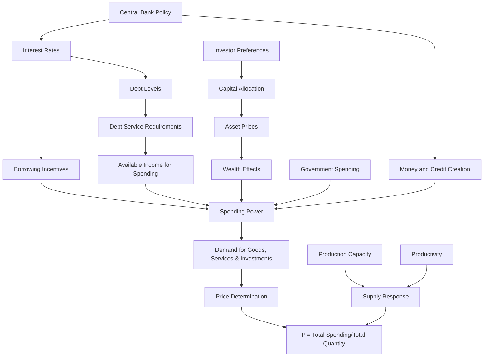
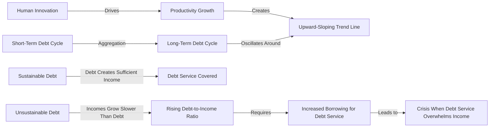
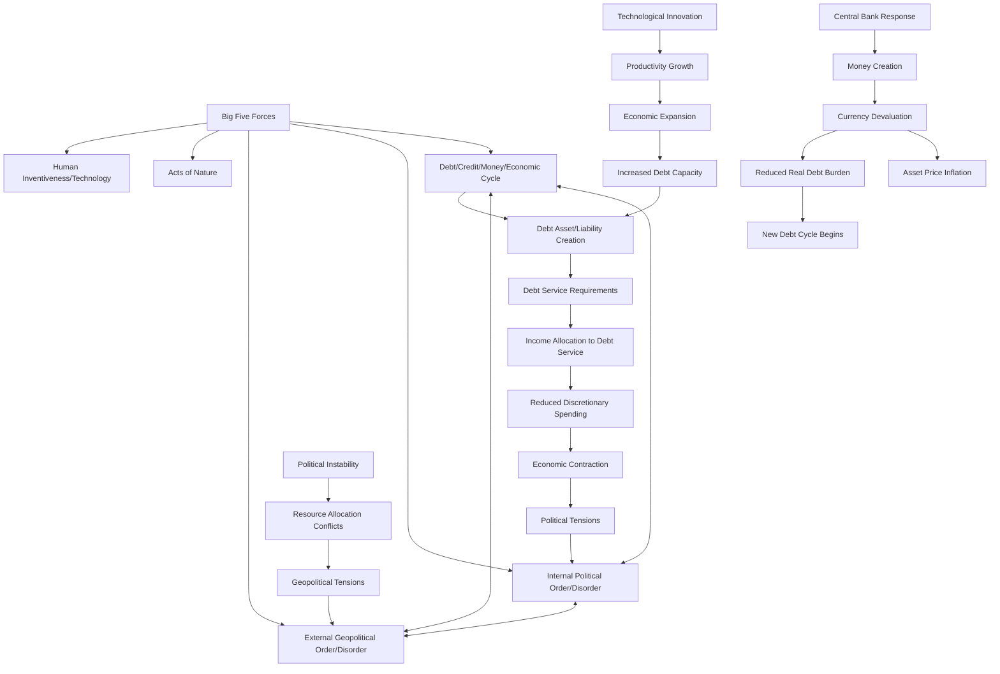
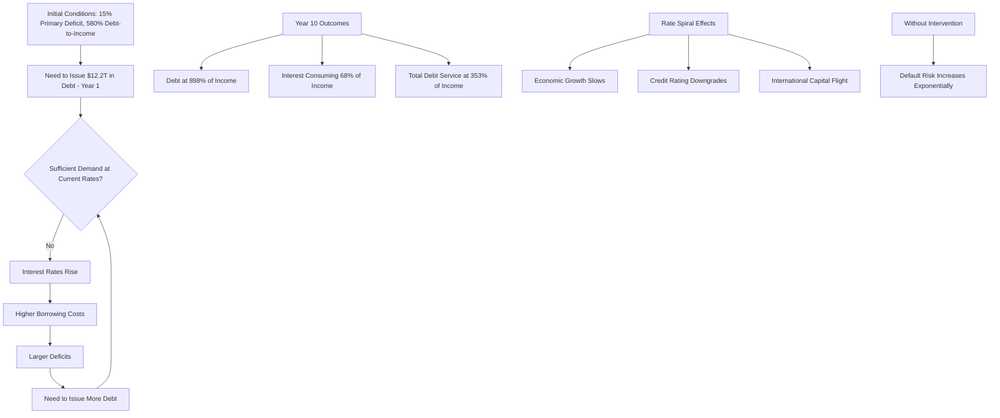
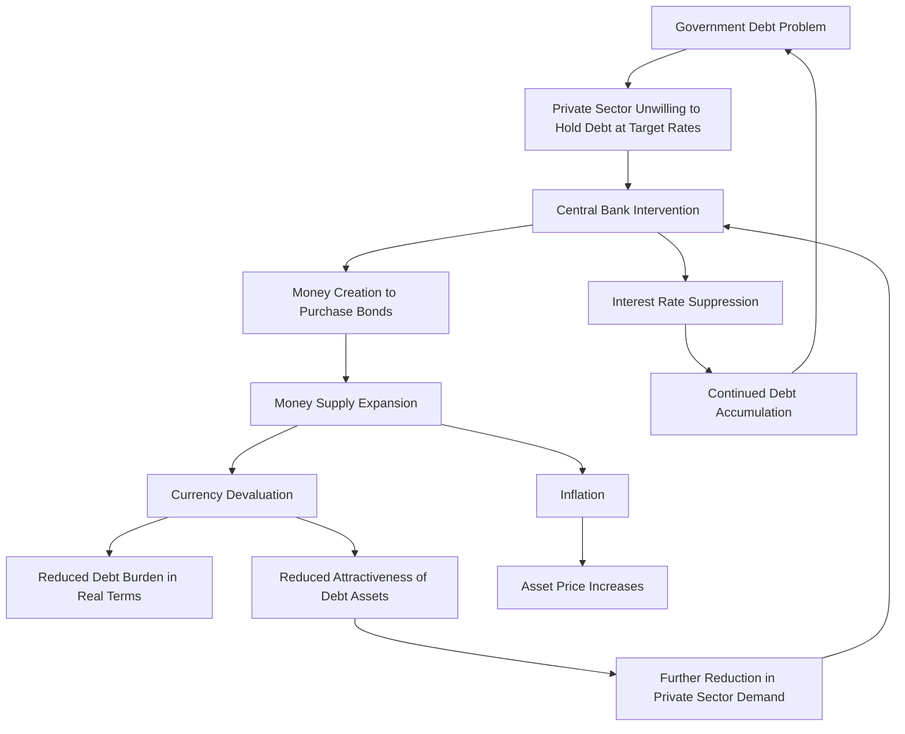

# Chapter 2: The Mechanics in Words and Concepts — Reimagined

**Note: This chapter presents unconventional conceptual frameworks on market mechanics that would be particularly valuable for finance professionals and aspiring practitioners, though it may extend beyond general interest reading. I encourage you to explore these concepts to determine if they align with your intellectual curiosities.**

Since every occurrence in markets stems from causal mechanisms, I conceptualize market dynamics as functioning like an intricate perpetual motion machine. Comprehending this machine requires understanding its fundamental mechanics, and given the interconnectedness of all elements, these mechanics exhibit remarkable complexity. Recent breakthroughs in artificial intelligence suggest we may soon achieve near-comprehensive understanding of these systems, but for now, we must employ traditional analytical methods enhanced by computational tools. This approach informed my development of the debt/credit/money/economic dynamic framework presented here—one crucial component of the broader systemic mechanics. While acknowledging this represents a simplified model, I offer it as an accessible entry point into these complex relationships.

From a macroscopic perspective, **the five most significant drivers of change** that demand our attention are:

- **The debt/credit/money/economic cycle**
- **The internal political order/disorder cycle**
- **The external geopolitical order/disorder cycle**
- **Acts of nature (droughts, floods, and pandemics)**
- **Human inventiveness, particularly technological innovation**

These powerful forces interact to shape major historical developments. For a more comprehensive exploration of these dynamics based on my research and experience, I recommend my book _Principles for Dealing with the Changing World Order_.

**This study focuses primarily on the first driver—the credit/debt/money/economic dynamic—with particular emphasis on the terminal phase of long-term debt cycles when central governments and central banks face insolvency.** We will begin by: a) examining the fundamental mechanics of market price determination, then b) analyzing the operational structure of long-term debt cycles. With this foundation established, we'll proceed to c) investigate the archetypal sequence leading to a nation reaching its debt capacity, with consequent monetary restrictions and institutional "bankruptcy" of central authorities. Throughout, we'll explore how the other four major forces interrelate, as understanding these interactions is essential for grasping the comprehensive Big Cycle dynamics. Current indicators suggest we are likely entering a particularly turbulent phase in this Big Cycle, driven by the convergence of these five fundamental forces, with potentially significant implications for global order. I hope this analysis contributes to enhanced understanding and more effective decision-making in navigating these transformational periods.

## How the Machine Works

**In my conceptual framework, money and credit function as the lifeblood of economic systems.** They circulate resources (specifically, purchasing power) from areas with excess capacity to those that can most productively deploy them. The central government serves as the brain directing system operations while also utilizing a portion of money and credit (typically 15-30%) to fulfill its functions (social programs, defense, etc.). The central bank operates as the heart, generating and distributing money and credit throughout the system. When these exchanges function optimally and capital recipients employ resources productively, all participants—capital providers, users, and the broader economic system—flourish. When they malfunction, the system experiences distress and potential trauma.

To clarify, viewing debt dynamics as a cyclical, perpetual motion machine operating consistently across time and geographies **doesn't negate temporal evolution or cross-national variations.** Rather, these variations are relatively minor compared to the timeless and universal mechanics and principles that remain insufficiently understood. My approach prioritizes identifying these enduring principles of systemic operation before examining contextual differences, as this methodology yields deeper insights into causal relationships. Accordingly, I'll begin with these fundamental mechanics and principles, presenting them in broad conceptual terms rather than granular detail.

## The Five Major Parts and How They Work

**My simplified model of the economic system comprises five essential components:**

- **goods, services, and investment assets,**
- **money used for purchasing these items,**
- **credit issued for purchasing these items,**
- **debt liabilities created through credit-based purchases, and**
- **debt assets (deposits and bonds) which, as the counterpart to debt liabilities, represent the opposite side of these obligations.**

**Understanding transactions through the lens of these five components provides substantial insight into the drivers of significant debt and economic cycles. I'll begin by outlining my transaction framework and other fundamental mechanics.**

As noted, **goods, services, and investment assets can be acquired using either money or credit.**

**Money, unlike credit, provides transaction finality.** When purchasing an item with money, the exchange concludes definitively. The nature of money has evolved throughout history across currency systems. For extended periods, money represented a promise to deliver specific quantities of gold or other hard assets. In contemporary fiat monetary systems, established globally since the US abandoned the gold standard in 1971, money functions more like credit—a promise of future purchasing power rather than an actual hard asset. However, **money differs fundamentally from credit in that it can only be created by central banks and in whatever quantities these institutions determine appropriate.**

**Credit, unlike money, creates ongoing payment obligations and can be generated through mutual agreement between any willing parties.** Credit generates purchasing power without necessarily creating new money. It enables borrowers to exceed their earning-based spending capacity in the near term, which elevates demand and prices for purchased items temporarily while simultaneously creating debt that, over longer horizons, requires borrowers (now debtors) to reduce spending below income levels to service their obligations. This future demand and price reduction contributes to systemic cyclicality. Since debt represents a promise to deliver money, and central banks control the money supply, central banks wield considerable influence. Though not precisely proportional, expanded money supply enables greater credit extension and spending capacity; conversely, contracted money supply constrains credit and spending potential.

## Price Determination Mechanisms

**To elucidate my framework for understanding price determination—which differs from conventional economic approaches—I must begin with the most fundamental building block of market understanding: the transaction.** All markets and economic activities essentially represent aggregations of constituent transactions. At its core, a transaction involves a buyer transferring money (or credit) to a seller, who in turn provides a good, service, or financial asset to the buyer. The price in any transaction equals the total monetary/credit value provided by the buyer divided by the quantity delivered by the seller, and a market comprises the aggregate of these exchanges. For example, a wheat transaction occurs when a buyer delivers a specific monetary sum to a seller in exchange for a certain wheat quantity, and the wheat market encompasses all buyers and sellers conducting various wheat-related exchanges for different purposes over time—these collective exchanges ultimately determine the price. Therefore:

_**Price (P) = Total expenditure on item ($) / Total quantity sold (Q)**_

_**Or, more simply:**_

_**P = $/Q**_

**In other words, since any good, service, or financial asset's price equals total buyer expenditure ($) divided by total seller quantity (Q), knowledge of total spending and total quantity sold provides complete price information and all other necessary insights.** This relationship is indisputable, making this approach the optimal method for price estimation—calculating total spending and dividing by total quantity sold. And what is the most effective way to estimate these variables? By understanding buyer and seller motivations. All buyers have specific reasons for allocating particular monetary amounts to acquire certain quantities, just as all sellers have distinct reasons for offering specific quantities to receive particular payments. **This relationship is illustrated in the conceptual diagram below.**

**While this framework might appear complex, its essence is straightforward.** For each product, buyers and sellers operate with distinct motivations driving their transaction decisions, and identifying principal market participants and their incentive structures is relatively straightforward. By understanding major buyers' spending motivations and major sellers' supply motivations, you can predict their behaviors with considerable accuracy, and consequently, price movements.

**This price determination approach diverges significantly from mainstream economic methodologies.** The traditional approach measures both demand and supply in quantity terms (quantity bought and quantity sold), whereas my approach examines expenditure amounts rather than purchase quantities. This creates fundamentally different explanatory mechanisms for price changes. Conventional frameworks describe price adjustments as responses to changes in demand quantity and/or supply quantity, explained through price elasticity concepts. This implies uniform demand elasticity and supply elasticity, generating various theories about market information processing.

**I find this conventional approach conceptually problematic because it presupposes that supply changes will consistently produce identical price effects (constant elasticity), which empirical evidence contradicts.** For example, if consumer spending on a product increases due to enhanced purchasing power, that product's price will rise. Ultimately, for price movement understanding and prediction, analyzing market participant behaviors and their relationship to price dynamics proves far more effective than conventional approaches. I developed this methodology as a commodities trader in the 1970s and discovered its superior performance compared to traditional frameworks, with applications extending across diverse product and asset categories, including financial instruments. In fact, I employ this template not only for specific market modeling but for entire economic systems, though that represents a topic for separate discussion.

Examining the previously introduced formula/model reveals that **prices change in response to spending rate and/or sales quantity variations.** For instance, if purchasing activity decreases from (X) to (X minus 10%), with all other factors constant, price will decline by 10%. **By identifying unsustainable buying and/or selling patterns, you can anticipate price and economic reversals before they materialize. By calculating the required adjustment to more sustainable buying/selling levels, you can estimate the probable price change magnitude.**

This alternative framework generates numerous implications for market and economic functioning. The most significant implication for understanding short-term market and economic cycles is its demonstration that these cycles are driven more by money and credit creation (influencing spending (S)) than by sold quantity changes (Q), since most goods, services, and investment assets are produced in response to demand (S). Additional observations include:

_**When a) expanded money and credit creation increases spending, and b) producers maintain capacity for increased production, then c) non-inflationary growth potential exists because both spending ($) and quantity sold (Q) increase.**_

_**Conversely,**_

_**When a) expanded money and credit creation increases spending, but b) production capacity constraints limit output expansion, then c) minimal real growth occurs alongside significant inflation.**_

These principles explain why early economic cycles (characterized by excess capacity and stimulative central bank policies) feature robust growth with minimal inflation, while late cycles typically exhibit anemic growth accompanied by substantial price increases. This pattern describes cyclical inflation and growth dynamics. Later sections will explore this in greater detail, examining monetary inflation and inflationary depression characteristics.

**How does productivity influence this framework? Elevated productivity growth enables producers to increase output (Q) alongside monetary and credit expansion, allowing non-inflationary growth to persist longer.** Productivity measurement presents challenges, as productivity improvements may manifest as quality enhancements or marginal cost reductions approaching zero (as observed in digital photography and electronic book production).

**Now let's examine buyer spending and seller quantity motivations more closely.** Rather than analyzing individual items, I'll focus on broad categories to illustrate principles affecting all market segments.

- _**Individuals purchase goods and services for consumption and investments for wealth accumulation.**_ Their allocation between consumption and investment depends on **desired goods and services costs relative to available money and credit, and the comparative appeal of consumption versus financial asset acquisition.** Naturally, individuals have specific preferences determining which goods, services, and financial assets they select.
    
- _**Spending decisions reflect relative appeal assessments across items.**_ Individuals continuously make comparative evaluations in two dimensions: 1) item exchanges (e.g., money for commodities, gold, currencies, or other assets) and 2) temporal delivery preferences for identical items (e.g., comparing immediate versus future delivery of commodities, gold, or currencies). This creates an extensive matrix of relative-value assessments. Arbitrage opportunities and high-probability trades represent the most powerful determinants of relative pricing.
    
- _**Currencies function as both exchange mediums and wealth repositories (in debt assets).**_ **They facilitate transactions and investment activities.**
    
- _**Investments represent current money and credit exchanges for future money and credit.**_
    
- _**All investment markets derive value through two mechanisms: yields and price appreciation. Combined, these create total return. Therefore, for all investments: total return = yield + price change.**_
    
- _**Investment markets primarily compete based on total return potential.**_ This occurs because a) most investors prioritize total returns over specific yield or appreciation components and b) arbitrage mechanisms exist to exploit total return differentials.
    

To illustrate this dynamic, consider how investors might compare bond and gold investments when determining price relationships. Since gold generates no yield while a US Treasury bond provides a yield of X% (e.g., 5%), rational investment in gold requires expected price appreciation exceeding X% annually (e.g., 5% annually). Stated differently, market pricing implies gold price appreciation of 5% relative to Treasury prices. Investors formulate expectations about gold price drivers (a significant factor being inflation expectations based on monetary and credit expansion), then evaluate the relative attractiveness of the 5% bond yield against projected gold appreciation stemming from monetary devaluation. If investors anticipate gold appreciation below 5%, they can purchase bonds and sell gold; conversely, if gold appreciation is expected to exceed 5%, they can implement the opposite strategy. Either approach generates profits if forecasts prove accurate. Beyond this fundamental price analysis, extensive financial engineering (leverage application and hedging) transforms assets to create equivalent exposures for relative value positioning and arbitrage, generating comprehensive market pricing matrices.

Substantial capital allocation follows these mechanisms, and profitable opportunities would abound if asset selection were straightforward. However, since market profitability presents significant challenges, we can infer that markets generally perform effectively in formulating estimates and pricing assets appropriately. Simultaneously, since successful investors like myself couldn't achieve outperformance in perfectly efficient markets, we can conclude that market imperfections exist, creating profit opportunities for those with superior understanding. Regardless, this framework provides effective market pricing analysis, which will prove valuable for understanding the debt/credit/money/economic dynamic.

- **The anticipated inflation-adjusted returns on investment assets (real returns) significantly influence capital allocation across investment categories. Generally, an investment's real returns exceed in importance its nominal returns because a) investments serve as wealth preservation vehicles where purchasing power remains paramount, and b) arbitrage and relative value positioning between real and financial assets drive their comparative pricing.** In other words, financial investment returns are evaluated against potential returns from real asset investments (real estate, precious metals, commodities, art, etc.), so investment returns—particularly government bond returns (where yields are fixed and default risk is minimal for domestic currency-denominated securities)—are benchmarked against inflation rates. When bond yields underperform inflation, investors sell bonds and purchase inflation-hedge assets, and vice versa. Additionally, since monetary and credit expansion by central banks typically devalues these instruments and increases prices across goods, services, and financial assets, substantial money and credit creation generally directs investors toward inflation-protective assets.
    
- **Pricing relationships operate through specific determinants requiring comprehension for relative pricing analysis.** When most retail investors consider pricing, they typically focus on immediate delivery pricing (spot prices). However, markets also establish prices for future deliveries (forward or futures prices), enabling arbitrage or relative value positioning that determines temporal price relationships for identical items. Similar comparative analysis occurs between financial assets with varying characteristics (e.g., short-term versus long-term government debt), with a significant determinant being anticipated central bank interest rate trajectories.
    

## Debt Is Currency and Currency Is Debt

**Since debt assets represent promises to receive specified currency amounts at future dates, debt and currency essentially constitute identical instruments. Disliking a currency logically entails disliking its debt assets (e.g., bonds), and conversely, disliking bonds necessitates disliking the underlying currency, accounting for yield differentials.** Recall the previously discussed gold/bond price comparison process evaluating relative yields plus expected price changes to determine relative total returns. This mechanism establishes spot and futures pricing for bonds and gold, and operates similarly for assessing different currencies and debt instruments across countries. This assessment drives significant capital flows with important implications for debt dynamics.

More specifically:

Let's assume the government interest rate (generally considered default-risk-free because central banks can create money to fulfill payment obligations) in one country (e.g., Japan) falls below another country's rate by X% annually. Under these conditions, the lower-interest currency must appreciate at an equivalent percentage rate. Otherwise, risk-free profit opportunities would emerge (through ownership of higher-yielding bonds). Instead, interest rate differentials are typically offset by depreciation in higher-yielding currencies relative to lower-yielding alternatives.

But what if currency movements aren't expected to compensate for interest rate differentials? For example, if Country A's 10-year interest rate is lower (e.g., 3% lower) than Country B's equivalent bond, normal expectations would anticipate Country A's currency appreciation (offsetting the interest disadvantage). What if, instead, Country A's currency is projected to depreciate (e.g., by 2% annually)? This creates virtually risk-free profit opportunities. Investors will aggressively pursue this strategy, selling the lower-yielding currency/debt. This will trigger one of two adjustments (or some combination):

A) The spot currency must depreciate substantially (40% in this example), or B) The 10-year interest rate must increase by 5%, reducing bond prices by approximately 40%. Alternatively, if these adjustments cannot occur (perhaps due to capital controls)—if interest rates remain 3% lower while currency depreciates by 2%—the relative loss compared to Country B's bonds will be 5% annually, compounding to 40% over the decade.

Any scenario produces severely negative returns for Country A's currency-denominated bonds. If nominal bond returns remain adequate (bonds maintain value and nominal debt burdens remain stable) because neither a) bond prices decline in the local currency due to interest rates rising to provide appropriate returns given currency depreciation, nor b) currency weakens sufficiently to offset inadequate interest rates, then negative bond performance manifests through c) annual interest rates and currency weakness failing to compensate for inflation.

Having established these major component mechanics and how transactions reflect participant motivations, you'll now understand the system's operational structure and probable future developments.

## The Major Types of Players and How They Behave to Drive What Happens

**Five primary participant categories drive money and debt cycles:**

- **Borrower-debtors (entities that borrow and incur debt obligations, including private and government institutions),**
- **Lender-creditors (entities that provide loans and acquire debt assets, including private and government institutions),**
- **Financial intermediaries (commonly called banks) that facilitate money and credit transactions between lender-creditors and borrower-debtors,**
- **Central governments, and**
- **Government-controlled central banks, which generate money and credit in national currencies and influence monetary and credit conditions.**

_**Credit/debt expansion requires mutual willingness from borrower-debtors and lender-creditors to engage in these transactions, meaning arrangements must satisfy both parties.**_ Since one entity's debts constitute another's assets, the system fundamentally requires both borrower-debtors and lender-creditors to participate in these exchanges. **However, optimal conditions for one participant often disadvantage the other.** For example, borrower-debtor success requires moderate interest rates, while lender-creditor success demands sufficient yield. **Excessive interest rates can force borrower-debtors to curtail spending or liquidate assets for debt service, potentially leading to default, triggering market and economic contractions. Simultaneously, inadequate interest rates discourage lending and promote debt asset liquidation, forcing interest rates higher or compelling central banks to create money and purchase debt to artificially suppress rates. This monetary expansion generates inflation, eroding wealth and economic activity.**

Over time, environments oscillate between favorable and unfavorable conditions for lender-creditors and borrower-debtors. Distinguishing between these environments is essential for market and economic participants. This balancing mechanism operates naturally, though certain conditions may preclude achieving optimal equilibrium, creating substantial debt, market, and economic vulnerabilities. Before exploring these risk factors, I'll examine other participants' motivations and behavioral patterns.

**Private sector banks function as intermediaries between lender-creditors and borrower-debtors, making their operational incentives and mechanisms similarly important.** Across all countries throughout history, banks have pursued essentially identical objectives—generating profits by borrowing from some entities and lending to others, capturing spread differentials. Their operational methods create money/credit/debt cycles, most significantly unsustainable bubbles and severe debt crises. How do these bubbles and crises develop? **Through extensive bank lending vastly exceeding their capital reserves, accomplished by repeatedly borrowing at costs below lending returns. This benefits society and generates bank profits when borrowers productively deploy capital sufficient for loan repayment—and when bank depositors don't simultaneously demand withdrawals exceeding available reserves. However, debt crises emerge when loans perform inadequately or when creditor withdrawal demands exceed bank liquidity.**

_**Over extended periods, debt growth cannot outpace the income necessary for servicing these obligations, and interest rates cannot remain excessively high for borrower-debtors or inadequately low for lender-creditors indefinitely.**_ Persistent debt expansion beyond income growth and/or interest rate imbalances eventually trigger significant market and economic disruptions. **Monitoring these ratios provides valuable insights.**

_**Major debt crises materialize when debt assets and liabilities become disproportionately large relative to available money supply and/or existing goods and services.**_

**Central banks directly or indirectly create money and credit, which constitutes "purchasing power" and determines aggregate expenditure on goods, services, and investment assets.** All created money and credit must flow into goods, services, and/or financial assets. Consequently, **total money and credit creation establishes aggregate spending across these categories.** As a result, goods, services, and financial assets typically experience synchronized appreciation and depreciation corresponding with money and credit expansion and contraction, similar to vessels rising and falling with tidal movements. **The specific allocation of money and credit and the production volumes of goods, services, and financial assets largely reflect decisions by countless market participants.**

**Central banks evolved to moderate these cycles, particularly to manage significant debt crises.** Until relatively recently (1913 in the United States), most countries lacked central banking institutions, and private bank money typically consisted of physical gold or silver, or certificates redeemable for these precious metals. Throughout these periods, boom-bust cycles persisted as borrower-debtors, lender-creditors, and banks experienced the credit/debt cycles previously described. **These cycles culminated in severe debt and economic collapses when excessive debt assets and liabilities triggered lender-creditor "runs" seeking repayment from borrower-debtors, particularly banks. These runs produced debt/market/economic contractions that ultimately prompted governments to establish central banks providing emergency liquidity during significant debt crises. Central banks also moderate cycles by adjusting interest rates and money/credit availability to influence borrower-debtor and lender-creditor behavior.** How do central banks generate funding? They "create" money (physically and digitally), which, when implemented aggressively, alleviates debt challenges by providing desperately needed liquidity that would otherwise be unavailable. However, this simultaneously reduces money and debt asset purchasing power while accelerating inflation.

**Central banks aim to maintain sustainable debt growth, economic expansion, and price stability. In essence, they seek to prevent excessive or insufficient debt and demand growth while avoiding destructively high or low inflation. To achieve these objectives, they adjust interest rates and monetary conditions—either tightening or loosening policy—influencing lender-creditors and borrower-debtors pursuing profitability.**

**Central governments** operate as political organizations with leadership accountable to citizens, creating incentives to satisfy public demands. This typically involves expenditure without corresponding revenue generation, leading to central government borrowing that reinforces credit stimulus cycles in early phases and debt contraction in later phases. Effectively managed central governments tax and spend to promote broad productivity and prosperity, sometimes borrowing beyond revenue and subsequently repaying these obligations, while effective central banks maintain relative balance in credit, debt, and capital markets, reducing disruptive cyclical volatility. Nevertheless, the inherent bias toward economic and market stimulus through credit expansion creates long-term upward trends in debt and debt service relative to income until they become unsustainably large proportions of income.

_**As debt assets and liabilities increase relative to productive income, maintaining equilibrium becomes increasingly challenging, heightening the probability of debt-induced market and economic contractions.**_

**Since borrower-debtors, lender-creditors, banks, central governments, and central banks represent the dominant participants and cycle drivers, each operating with transparent incentives influencing behavior, anticipating their likely actions and subsequent developments becomes relatively straightforward. During periods of subdued debt growth, economic weakness, and low inflation, central bankers reduce interest rates and expand money and credit, incentivizing increased borrowing and spending across goods, services, and investment assets, stimulating markets and economic activity. In these environments, borrower-debtors prosper while lender-creditors struggle. Conversely, during unsustainable debt growth, economic expansion, and elevated inflation, central bankers raise interest rates and restrict money and credit, encouraging saving and reduced expenditure on goods, services, and investment assets. This suppresses markets and economic activity as lender-creditor-savers outperform borrower-debtor-spenders. This dynamic generates two interconnected cycles—a short-term pattern averaging approximately six years (±3 years) and a long-term pattern averaging roughly 80 years (±25 years)—which evolve around an upward productivity trend line reflecting human innovation.**

**I'll now briefly review these cyclical patterns:**

## The Short- and Long-Term (Big) Debt Cycles

By "short-term debt cycle," I refer to the sequence of 1) recessions leading to 2) central banks providing abundant affordable credit, creating substantial debt initially producing 3) market and economic expansions developing into 4) bubbles and inflation, prompting 5) central bank credit tightening, resulting in 6) market and economic deterioration. This cycle typically spans approximately six years (±3 years). At this writing, the US has experienced 12.5 such cycles since 1945—currently halfway through the 13th iteration. Each short-term debt cycle generally concludes with higher debt levels than its predecessor because policymakers combat recessions by lowering interest rates sufficiently to stimulate borrowing.

By "long-term (big) debt cycle," I mean the process of accumulating debt assets and liabilities over extended periods (successive short-term debt cycles) until reaching unmanageable proportions. This culminates in simultaneous substantial debt restructuring and significant debt monetization, producing periods of extreme market and economic turbulence.

_**The short-term debt cycles aggregate to form long-term (big) debt cycles, which I'll subsequently refer to as the Big Debt Cycle.**_

These cycles influence markets and economies around an upward-sloping trend line of improving living standards resulting from human innovation and consequent productivity gains. The upward productivity slope primarily reflects the ingenuity of practical individuals (entrepreneurs) receiving adequate resources (capital) and collaborating effectively with stakeholders (colleagues, government officials, legal advisors, etc.) to enhance productivity.

Over brief intervals (1-10 years), short-term debt cycles predominate. Over extended periods (10+ years), the long-term debt cycle and productivity trend line exert substantially greater influence. Conceptually, this dynamic manifests as follows:

_**What distinguishes sustainable from unsustainable debt cycles is whether debt generates sufficient income to cover debt service requirements. When incomes fail to grow proportionately with debt and debt service, the ratio of debt to income mechanically increases, necessitating additional borrowing for both debt service and expenditure.**_ **The cycle progresses from moderate to elevated to unsustainably high debt and debt service relative to income.** _**A reliable indicator of approaching debt crisis is substantial and increasing borrowing specifically allocated to debt service payments.**_

Why don't central bankers more effectively moderate these debt cycles through better containment preventing dangerous accumulation? Four factors contribute:

1. Most stakeholders, including central bankers, prefer market and economic expansion because of its rewards, while discounting future debt repayment challenges, so they extend credit until debt becomes so burdensome that restructuring becomes necessary to reduce obligations relative to income.
2. Precise risk thresholds for debt remain ambiguous because future income determinants contain uncertainty.
3. Restricting credit entails opportunity costs and risks.
4. Even severe debt crises can typically be managed to maintain acceptable disruption levels.

_**Debt isn't inherently problematic, even when economically suboptimal.**_ Insufficient credit/debt growth can create economic difficulties comparable to or worse than excessive growth, with costs manifesting as foregone opportunities. This occurs because 1) credit can fund transformative improvements lacking immediate profitability that would otherwise remain unrealized and 2) debt-related losses can be distributed to maintain tolerable impact when governments control debt restructuring processes and debt is denominated in currencies that central banks can create. Nevertheless, crisis prevention requires debt to generate income sufficient for servicing obligations.

_**Across successive cycles, debt liabilities and assets have consistently increased, driving long-term debt cycle expansion. This pattern invariably continues until debt burdens become unsustainable or debt asset returns become inadequately low.**_

**When debt assets and liabilities become disproportionately large relative to income, central bankers face significant challenges maintaining interest rates high enough to satisfy lender-creditors without severely disadvantaging borrower-debtors, while simultaneously balancing growth and inflation considerations. As debt asset holders seek liquidation, poor debt returns become inevitable. This forces central bankers to choose between:**

1. **Rejecting debt monetization** (avoiding money printing and debt purchases) and allowing interest rates to rise sufficiently to reduce credit demand and economic activity until reaching equilibrium between bond buying and selling. This enhances cash value, devalues most other assets including equities and real assets, triggers deflation, precipitates debt defaults and restructurings, and suppresses economic activity. This typically represents the initial phase but becomes intolerable, leading central banks to initiate...
    
2. **Implementing debt monetization** (printing money and purchasing debt) to address demand shortfalls, increasing money availability while reducing its value, thereby accelerating inflation, appreciating most other assets including equities and real assets, minimizing debt defaults, and stimulating economic activity. This typically occurs subsequently.
    

During this phase of the Big Debt Cycle, substantial reductions in debt liabilities and assets become necessary. These represent major debt crisis periods. These significant debt restructurings and monetizations conclude the preceding Big Debt Cycle by reducing debt burdens and eliminating the previous monetary order, initiating the subsequent Big Debt Cycle and monetary regime. These transitions parallel major domestic political restructuring and global order realignments—representing seismic shifts following established order breakdown. Policymakers can employ four mechanisms to reduce debt burdens:

1. austerity (reduced spending),
2. debt defaults/restructurings,
3. central bank money creation and asset purchases (or guarantee provision), and
4. wealth and credit transfers from surplus to deficit entities.

Policymakers typically implement austerity initially as the intuitive approach, reflecting natural inclinations to hold those responsible for problems accountable. This represents a significant error. Austerity fails to reconcile debt and income because one entity's debts constitute another's assets. Debt reduction diminishes investor assets creating "impoverishment," and since expenditure generates income, spending cuts reduce revenues. Consequently, debt and spending reductions produce corresponding declines in net worth and income, creating severe hardship. Additionally, economic contraction typically reduces government revenue while increasing support demands, expanding deficits. Seeking fiscal responsibility, governments often raise taxes, further constraining individuals and businesses. More fundamentally, when expenditure exceeds revenue and liquid liabilities exceed liquid assets, borrowing and debt asset sales become necessary, which, without sufficient demand, produces either deflationary or inflationary crises.

**As previously noted, policymakers can most effectively reduce debt burdens without triggering major economic crises through what I term a "beautiful deleveraging," combining 1) debt restructuring to extend or eliminate debt service payments (deflationary and contractionary) with 2) central bank money creation and debt purchases (inflationary and expansionary). Implementing these approaches in balanced proportions distributes and reduces debt burdens while generating nominal economic growth (inflation plus real growth) exceeding nominal interest rates, so debt burdens decline relative to income.**

Properly executed, this balances the deflationary and contractionary effects of reduced debt payments against the inflationary and expansionary impact of money creation and central bank debt purchases. Across the analyzed countries, most significant debt crises involving domestically denominated obligations underwent rapid restructuring, typically within one to three years. These restructuring periods present substantial risks and opportunities. For comprehensive insights into these periods and processes, consult _Principles for Navigating Big Debt Crises_.

## The Big Debt Cycle, Its Risks, and How to Deal with It Need to Be Better Understood

**Because the truly consequential debt crises—manifesting as debt restructurings and devaluations concluding Big Debt Cycles—occur approximately once per generation, they remain inadequately understood compared to short-term cycles.** **This motivated my research.** More specifically, long-term and short-term debt cycle conclusions involve distinct mechanisms, so most observers neither recognize nor anticipate long-term debt cycle termination despite its significantly greater implications than short-term cycle conclusions. This creates dangerous vulnerability. The situation resembles cardiovascular disease progression—consuming high-fat foods causing arterial plaque accumulation while dismissing concern because symptoms remain absent, despite increasing heart attack probability.

Let's recognize healthy economic conditions, which include 1) private sector lenders extending credit exchanged for debt benefiting both parties because funds generate profitable returns and 2) government borrowing deployed for productivity enhancement (infrastructure improvement, education advancement, etc.) generating tax revenue, or occasional counter-cyclical deficit spending during economic weakness followed by repayment during robust conditions. Similarly, let's acknowledge unhealthy practices, including 1) central banks persistently creating money and purchasing debt to address demand deficiencies and 2) central governments maintaining chronic substantial deficits producing debt and debt service growth exceeding the income (government tax revenue) required for servicing these obligations.

## In Summary and to Reiterate:

- _**Goods, services, and investment assets can be created, purchased, and sold using money and credit.**_
- _**Central banks can generate money and influence credit volumes in whatever quantities they determine appropriate.**_
- _**Borrower-debtors ultimately require sufficient money and manageable interest rates to facilitate borrowing and debt service.**_
- _**Lender-creditors require adequate interest rates and acceptable debtor default rates to achieve satisfactory returns justifying lending and creditor positions.**_
- _**This equilibrium becomes progressively more challenging as debt assets and liabilities increase relative to income. Eventually reduction becomes necessary, triggering deleveraging.**_
- _**The optimal deleveraging approach—what I term a "beautiful deleveraging"—can be orchestrated by central governments and central banks to reduce debt burdens when obligations are denominated in domestic currencies. Foreign currency-denominated debt produces significantly more disruptive deleveraging. Further explanation follows.**_
- _**Long-term financial health requires productivity and balanced income statements (revenue exceeding expenditure) and healthy balance sheets (assets exceeding liabilities).**_
- _**Understanding each country's position in the credit/debt cycle and anticipated participant behaviors enables effective cycle navigation.**_
- _**Historical patterns provide instructive precedents for future developments.**_

## Important Takeaways:

- _**Debt crises are inevitable. Throughout history, only exceptionally disciplined countries have avoided debt crises. This reflects imperfect lending practices and frequent lending dysfunction resulting from cyclical psychological influences generating bubbles and busts.**_
- _**Most debt crises, even severe episodes, can be effectively managed by economic policymakers when properly distributed.**_
- _**All debt crises create investment opportunities for informed investors applying sound navigational principles.**_
- _**Invariably, during the terminal phase of the Big Debt Cycle characterized by excessive debt, maintaining sufficient real interest rates to satisfy lender-creditors without overburdening borrower-debtors becomes increasingly difficult, forcing central banks to navigate between these competing objectives. Typically during these periods, both contractionary tight-money policies and inflationary loose-money approaches materialize, with sequencing representing the primary variable. Regardless, holding debt/currency of excessively indebted governments during these periods constitutes poor investment strategy.**_
- _**Central banks must choose between preserving "hard" money, forcing debtor defaults and triggering deflationary depressions, or implementing "soft" money through extensive creation, devaluing both currency and debt. Since debt repayment with hard money produces severe market and economic contractions, when confronting this decision, central banks invariably select money printing and devaluation. For case studies, consult Part 2 of Principles for Navigating Big Debt Crises. Importantly, each country's central bank can only create its domestic currency, which leads to my next critical observation.**_
- _**When debts are denominated in domestic currency, the central bank can and will "print" money to mitigate debt crises. This enables more effective management than scenarios without monetary creation capability, though it necessarily reduces money's value.**_

## The Other Four Big Forces Affect How This Debt Cycle Transpires Just as This Debt Cycle Affects How the Other Four Forces Transpire Together

Thus far, I've addressed debt cycles exclusively since they constitute this study's focus. However, numerous factors interact to determine outcomes, so comprehensive analysis requires acknowledging these influences. My book _Principles for Dealing with the Changing World Order_ examines these extensively. While presenting 18 major condition drivers in that work, the five fundamental forces explaining most developments are: 1) money/credit/debt/markets/economic cycles, 2) internal social and political order/disorder cycles, 3) international order/disorder cycles manifested through peace/war patterns, 4) natural disruptions including droughts, floods, and pandemics, and 5) human innovation, particularly technological advancement enhancing productivity. Interactions between these forces drive condition changes. They typically reinforce each other bidirectionally. For example, financial and economic crises increase internal conflict probability, while internal conflicts deteriorate financial and economic conditions. Similarly, internal financial difficulties and political conflicts weaken affected countries and, when globally prevalent, increase international conflict likelihood. Collectively, these forces generate the significant cycles of advancement and decline, peace and conflict, occurring within and between nations, producing substantial changes in domestic and international orders.

These major cycles of progress and regression become readily apparent by monitoring the 18 forces (particularly the fundamental five) I've identified. For instance, **great power and monetary decline clearly manifests through 1) persistent indebtedness increases accompanied by progressive weakening of monetary systems designed to restrict credit-and-debt-growth-motivated attempts to stimulate credit and economic expansion, and 2)** **deterioration across various health indicators including education quality, infrastructure condition, legal enforcement, civil behavior, and governance effectiveness relative to competing global powers.**

I won't elaborate on these comprehensive mechanisms—both because such exploration would exceed our current focus and because my book and even my brief [video](https://observatory.bwater.com/document/market-insights/economic-frameworks/principles-for-dealing-with-the-changing-world-order-video), both titled _Principles for Dealing with the Changing World Order_, provide more thorough treatment. I'll now examine the Big Debt Cycle mechanics through numerical and equation-based analysis, presented as accessibly as possible.

# Chapter 3: The Mechanics in Numbers and Equations — Reimagined

**Advisory: This chapter delves into debt mechanics, including fundamental equations that facilitate anticipating debt limitation consequences. This material should prove valuable for finance professionals and aspiring practitioners, though it may exceed general interest parameters. I recommend scanning for key concepts before determining whether deeper exploration aligns with your objectives.**

**While Chapter 2 presented a conceptual framework describing how central governments and central banks typically encounter financial constraints, this chapter provides quantitative models and equations for anticipating these financial challenges, including formulaic examples illustrating how elevated debt burdens compound and generate systemic pressures.**

**I'll begin by examining debt sustainability's key drivers and their interactions. First, let me define an "unsustainable" debt burden. The concept is fundamentally straightforward:** ***an "unsustainable" debt burden exists when expenditure exceeds income, either because

- a) savings (stored resources) decline and/or
- b) borrowing increases until savings are exhausted and/or borrowing capacity is eliminated, at which point debt failure occurs.***

**Conceptualize this monetary flow as analogous to blood circulation, with income statements and balance sheets providing diagnostic reports. Healthy financial conditions exist when income equals or exceeds expenditure while debt growth remains proportionate to income expansion. This doesn't suggest debt growth is inherently problematic. When debt expansion generates income growth exceeding debt service increases, resulting in positive cash flow, financial health improves. When debt grows faster than income, the dynamic resembles arterial plaque accumulation, restricting income available for spending or saving by increasing debt service requirements. Excessive restriction can trigger default—the economic equivalent of myocardial infarction. Interest rates significantly influence required payments and lender-creditor willingness to hold and acquire debt assets and liabilities. As debt service requirements expand relative to income and savings, financial constraints develop, precipitating debt distress.**

**We can evaluate debt burdens through several metrics, recognizing that as they increase or rapidly escalate, default and/or devaluation risks correspondingly intensify.** **While I monitor approximately 35 indicators for debt risk assessment, four critical metrics stand out:**

**1. Debt-to-income ratios.** As debt increases relative to income, ceteris paribus, debtors face higher interest and principal obligations, progressively constraining discretionary spending capacity. Elevated debt-to-income ratios create two vulnerabilities: 1) increased risk that existing debt won't secure refinancing from creditors and 2) higher debt service payments as a percentage of income, reducing discretionary spending capacity. This connects to our second metric.

**2. Debt service-to-income ratios.** Debt service represents mandatory interest and principal payments required to avoid default. As debt service consumes increasing portions of income, it either restricts spending or necessitates additional borrowing, further expanding future debt service obligations. This progression causes investors to anticipate credit deterioration, discouraging additional lending and/or promoting existing debt asset liquidation, accelerating credit challenges. For estimating debt and debt service accumulation, I examine interest rates relative to income growth rates.

**3. Nominal interest rates compared to a) inflation rates and b) nominal income growth rates (inflation plus real growth).** These comparisons serve two analytical purposes:

- They demonstrate how debt and debt service will likely evolve relative to income. For example, with debt equaling 100% of income, 5% nominal interest rates, and 3% nominal income growth, debt will approximate 102% of income in the subsequent year (assuming expenditure equals income).
    
- They indicate relative credit condition attractiveness for lenders versus borrowers. High nominal interest rates relative to nominal growth and inflation rates suggest conditions favoring lenders while disadvantaging borrowers, encouraging lending while discouraging borrowing/spending (reflecting heightened debt problem risk among indebted entities unable to create money for debt service). Conversely, conditions unfavorable for lender-creditors but favorable for borrower-debtors encourage borrowing while discouraging lending.
    

**4. Debt and debt service relative to savings (reserves).** Even with financially unhealthy conditions across previous metrics, substantial savings availability mitigates default risk by enabling savings utilization for debt and expenditure obligations.

***Inevitably, equilibrium levels will emerge for:

1. debt-to-income ratios,
2. debt service-to-income ratios,
3. nominal interest rates relative to inflation rates (real interest rates) and nominal growth rates, and
4. debt and debt service relative to savings. Monitoring these ratios reveals their progression toward extreme levels and subsequent reversion to more sustainable positions through various mechanisms. Understanding the causal relationships driving these fluctuations enables effective navigation and management.*** **Most importantly, comprehending the painful deleveraging process reveals that it can be effectively managed (reducing negative impacts) or mismanaged (exacerbating consequences).**

While these four indicators represent the most significant metrics, they aren't exclusively relevant. Chapter 4 will examine how broader indicators evolve through the terminal phase of the Big Debt Cycle, and Chapter 15 will apply my indicators to current US conditions. Nevertheless, these four primary metrics provide crucial insights about potential debt constraints and their severity when activated. However, they cannot precisely predict crisis timing because varying conditions and individual responses create different lead times for debt asset liquidation and other crisis-precipitating actions. Nevertheless, risk measurement remains feasible because _**countries with excessive debt levels, substantial deficits, minimal savings, and rapidly escalating interest rates face acute debt default or devaluation risks**_.

The remainder of this section presents formulaic examples illustrating how elevated debt burdens compound and generate systemic challenges.

## Measuring Debt Burdens in Numbers

_**The following mathematical relationships quantify these indicators.**_ These represent common-sense constraints on sustainable debt levels, expressed through equations that mirror the verbal constraints previously discussed. To enhance understanding, relate these to your personal debt limitations. I'll explain the principles and provide practical guidelines. **The subsequent pages elaborate on each relationship with examples. These formulaic relationships not only identify debt vulnerabilities but can guide policymakers toward remedial measures and help market participants position effectively. Feel free to proceed directly to examples if this approach would enhance your comprehension.**

_**1) Future debt-to-income projections.**_ _The estimation formula is:_

In conceptual terms: Future debt-to-revenue ratios reflect 1) spending excesses or deficits relative to revenue, 2) existing debt "compounding" effects, and 3) revenue growth. As expenses increase relative to revenue, borrowing becomes necessary, expanding new debt (first numerator term). As interest rates rise, existing debt grows more rapidly (second numerator term). As revenues increase, incomes grow relative to debt, reducing the debt-to-revenue ratio (denominator term).

Debt-to-income ratios provide valuable risk indicators because higher ratios signify greater risk and burden, ceteris paribus. For example, elevated debt increases refinancing rejection risk and complicates central bank efforts to maintain interest rates sufficiently low for borrower-debtors without disadvantaging lender-creditors. This relationship reveals how interest rates, income growth rates, and primary deficits (non-interest expenses versus revenue) significantly influence debt burden trajectories.

We can reconfigure this formula to determine conditions maintaining stable debt-to-income ratios. Several examples appear later in this chapter.

_**2) Future debt service-to-income projections.**_ _The estimation formula is:_

In conceptual terms: Future debt service-to-revenue ratios reflect future interest costs and principal payments relative to revenue growth. Substantial revenue growth reduces relative debt service burdens, ceteris paribus.

Future interest expenses depend on debt levels and average interest rates. Interest rate increases generally don't immediately impact interest expenses for existing debt, as longer-term bonds maintain fixed rates established at issuance. As bonds mature and refinance at prevailing rates, interest expenses gradually increase.

Principal payments represent maturing debt requiring repayment, typically through new debt issuance. Principal payment estimation often employs average maturity calculations—the duration until repayment obligations—for existing debt. During periods of debtor stress, creditors typically reduce lending duration, shortening debt maturity and increasing principal payments for equivalent debt levels.

_**3) Nominal interest rates relative to a) inflation rates and b) nominal income growth rates (inflation plus real growth):**_

The expected relationship between nominal interest rates and nominal growth rates indicates how debt and debt service will likely evolve. Below is the formula for interest rates maintaining stable debt levels and interest debt service relative to revenue. This derives from our first formula, reconfigured to determine required interest rates for maintaining stable debt-to-revenue ratios.

To conceptualize this relationship: with zero primary deficit (current expenses excluding interest equaling current revenue), debt remains stable when interest rates equal revenue growth rates. With primary deficits equaling 5% of current debt, interest rates must fall 5% below revenue growth rates for stability.

The intuition underlying this principle is that when interest rates equal revenue growth, debt compounds at rates matching income growth. If the government simultaneously borrows, debt must compound more slowly than income, requiring interest rates below revenue growth rates.

As interest rates increase relative to revenue growth, debt grows faster than income because existing debt compounds more rapidly than revenue expansion, and interest debt service costs escalate even more dramatically as both debt levels and interest rates increase, with interest expenses reflecting their combined impact. Conversely, declining interest rates slow debt growth while interest debt service costs grow more slowly or contract. (Japan has exemplified this pattern over two decades, examined further in Chapter 14).

Recognizing that we can determine required interest rates for debt stability, we can similarly calculate necessary deficit or surplus levels, required revenue growth, and additional variables. The chapter conclusion presents these calculations for the US and Japan.

_**4) Debt and debt service relative to savings (reserves):**_ Just as we can estimate debt burdens relative to income, we can calculate them relative to savings—by examining savings levels and changes rather than income metrics. The estimation formula is:

These formulas closely resemble (1) and (2), so I'll abbreviate the conceptual explanation. The distinction lies in examining debt and debt service relative to savings rather than income. Substantial debt accompanied by significant savings reduces concern, as savings can fund debt service and partial debt repayment. This creates a financial buffer.

Persistent deficits and negative expected surpluses rapidly increase debt and debt service relative to savings, creating more precarious conditions.

_**Several heuristics illustrate how these equations manifest in practice:**_

- _**When nominal interest rates equal nominal income growth**_ _**and governments maintain balanced primary budgets (revenue equaling non-interest expenditure), debt-to-income ratios remain stable. However, when interest rates exceed income growth, existing debt burden intensifies. This represents perhaps the most critical variable in our calculation. For example, an adverse but plausible scenario might feature interest rates exceeding income growth by 2%. This would increase the debt-to-income ratio by approximately 50% over two decades, even without primary deficits, leading to additional borrowing and debt accumulation. Consequently, initial debt at 50% of income would reach 75%, while 400% initial debt would grow to 600%.**_
    
- _**Debt service expense accumulation resembles arterial plaque buildup that increasingly restricts vital resource flow to the economy.**_
    
- _**The primary consequence of elevated debt is increased vulnerability to refinancing disruptions.**_
    

These mathematical relationships provide reliable estimates for debt service constraint magnitudes when existing debt undergoes refinancing. However, they don't capture the dynamics when debt asset holders seek liquidation. The next section addresses these considerations.

**I'll now present several examples illustrating how these drivers function and interact.**

## Example 1: Debts Relative to Incomes (Levels and Changes)

**As initial debt and deficit (borrowing) levels increase, future debt, debt service, and interest expenses correspondingly rise. The table below presents various outcome scenarios.** While debt-to-GDP ratios receive greater attention, debt-to-income ratios provide more relevant information for government debt service analysis. **For any debtor, including central governments, what matters most is expenditure (including debt service) relative to income, as this relationship creates debt constraints**; GDP size has only partial relevance. Both metrics provide approximate indicators of the economy's debt-bearing capacity.

For reference, US government debt currently represents approximately 580% of revenue (primarily tax income). Excluding interest, expenditures are projected to average ~115% of income over the next decade, creating a primary deficit—the differential—of ~15% of income. The US currently borrows ~20% of income annually for interest expenses on existing debt.

Assuming interest rates equaling income growth while incorporating actual projected US primary deficits (the gap between non-interest expenses and income), US government debt-to-income is projected to increase by approximately 150%, from 580% to 730% over the next decade. This would generate proportional increases in interest expenses and debt service burdens.

The table below shows projected debt levels after 10 years for various initial debt levels and deficits. The second table shows changes relative to initial debt levels. As initial debt and deficit levels increase, terminal debt levels correspondingly rise.

For contextual reference, current approximate metrics for major economies are:

## Example 2: The Effects of Nominal Interest Rates Minus Nominal Income Growth Rates on Debt-to-Income Ratios

**When interest rates exceed income growth rates, existing debt grows relative to income because debt compounds more rapidly than income expansion.**

**The tables below illustrate this relationship.** Previously, I demonstrated how debt evolves for different initial debt levels and deficits. This analysis assumes an initial deficit of 35% of income (reflecting CBO projections for the next decade). The rows still represent different initial debt levels. The columns now show the differential between nominal interest rates and nominal income growth rates. CBO projections indicate effective interest rates averaging 3.4% against 3.8% nominal growth over the next decade. This -0.4% differential places the US in the vicinity of the red-boxed area below.

The first table shows projected debt-to-income ratios after 10 years based on these assumptions, while the second table shows debt-to-income changes over the decade. **As interest rates increasingly exceed growth rates, debt accumulates more rapidly. Furthermore, as initial debt increases, the impact of elevated interest rates intensifies exponentially.**

Previously, I projected that with current debt and deficit levels, US debt would increase from 580% to 730% of income. Incorporating projected interest rates relative to nominal growth, we would expect US debt to reach 679% of income (assuming constant tax-to-GDP ratios). The pattern becomes evident.

Since projected interest rates modestly trail nominal growth, this adjustment minimally impacts the US debt outlook. However, if central banks sought to enhance central government debt sustainability, they could push interest rates further below nominal growth by purchasing government bonds, significantly slowing debt accumulation, ceteris paribus. Naturally, this would disadvantage lender-creditors holding debt assets through lower nominal and real interest rates than otherwise available. This likely illustrates the familiar pattern of central bank operations and future probabilities—specifically, why central banks historically implemented near-zero nominal rates and negative real rates through money creation and government debt purchases—and what likely developments await if current trajectories persist. More precisely, persistent debt growth will likely compel central banks to suppress real interest rates, reducing debt asset attractiveness for lender-creditors.

Economic systems feature numerous interrelated variables that change interdependently. The dynamic resembles a Rubik's Cube, where adjusting one component—one driver in the previous grids—triggers changes throughout the system. Understanding these interrelationships and projecting scenarios becomes complex. To illustrate this complexity, I've developed a simplified model examining one potential decade-long scenario.

Let's consider Example 3 below, featuring a government with metrics resembling current US government conditions. Let's assume 3.8% annual nominal income growth, 3.4% interest rates, and initial debt at 580% of government income. In this scenario, the government spends 35% more than income, including interest payments.

## Example 3: Interest Rates Spiral Upward to Keep Buyers in the Debt Assets

Since this government maintains a 15% primary deficit (excluding interest payments), it collects $5.2 trillion in revenue while spending $6 trillion in Year 1. Interest payments total $1.1 trillion, reflecting initial debt at 580% of government income with approximately 4% interest rates. Assuming about 35% of existing debt matures annually (reflecting US government debt maturity patterns) requiring refinancing—approximately $10.3 trillion of existing debt matures this year requiring repayment. **In total, this government must issue $12.2 trillion in debt during Year 1. What happens when public appetite for this debt diminishes or existing holders become net sellers at prevailing interest rates?**

Market clearing mechanisms necessitate interest rate increases until sufficient buyer demand emerges. However, rising interest rates increase government borrowing costs, exacerbating challenges and further reducing debt demand, creating additional upward interest rate pressure. **This "interest rate death spiral"—where rising rates worsen credit risk, reducing debt demand and further elevating rates—represents a classic debt crisis pattern. The table below illustrates this dynamic. This example assumes interest rates increasing 0.5% annually while nominal growth remains constant.**

If interest rates remained stable, government debt would reach 679% of income after Year 10, with interest consuming 22% of income. In this scenario, debt reaches 898% of income, interest consumes 68%, and total debt service (including principal) requires 353% of income. **Naturally, if interest rates increase due to debt unsustainability, they will accelerate as debt becomes increasingly unstable.** Simultaneously, elevated interest rates likely constrain income growth, further complicating debt sustainability. The worst-case scenario involves significant additional debt issuance (financing warfare or social benefits during recession), dramatically increasing interest rates.

**A Toy Model: Interest Rates Spiral Higher**

**Governments can prevent this spiral by reducing debt burdens.** I elaborated on this in _Principles for Navigating Big Debt Crises_, but to reiterate, governments have four mechanisms for reducing debt burdens:

- **Austerity** (reduced spending), which proves counterproductive since expenditure generates income, so austerity creates self-reinforcing deflationary contractions.
    
- **Debt defaults/restructurings**, which reduce debt burdens while creating deflationary effects since debt represents assets for creditors.
    
- **Central bank money creation and debt purchases**, which provide debt payment funding while generating inflation.
    
- **Wealth and credit transfers from surplus entities to government through taxation, subsequently redistributed to other private entities.**
    

Examining historical private debt crises revealed various combinations of these approaches, with strong preference for money creation and debt purchases (debt monetization) during severe debt constraints. Additionally, tax increases typically generate significant left-right political conflict. These patterns reflect logical responses. Government financial distress creates significant consequences because governments typically represent the largest economic component and the primary source for substantial non-economic social expenditures, particularly crucial during economic weakness. Delayed government spending and financial support likely exacerbates economic contraction, counterintuitively worsening debt burdens by reducing income growth and net worth, potentially triggering social instability. Consequently, indebted governments reducing expenditure to address debt challenges during these periods proves self-defeating. This raises the question: how do governments secure funding?

_**The most expedient approach, though suboptimal for long-term system sustainability, involves governments resolving debt challenges and maintaining desired spending through central bank money creation and bond purchases, thereby maintaining interest rates at manageable levels while injecting liquidity. Consequently, this becomes the invariable response when debts are denominated in domestic currencies.**_ Let's examine this mechanism.

## Example 4: Central Bank Steps in Because Private Players Are Unwilling to Hold the Desired Amount of Government Bonds to Keep Interest Rates at the Desired Level for Acceptable Economic Growth

Thus far, I've analyzed how initial debt-to-income ratios, income growth rates, spending growth rates, interest rates, and government debt maturity influence future debt burdens. As mentioned, debt demand significantly influences outcomes, and central banks can and typically do create money to purchase (monetize) debt. Let's examine this final component.

Numerous factors determine private market government debt demand. As previously explained, these include expected real bond returns relative to projected real returns for alternative assets, system-wide money and credit availability, perceived debt/currency crisis risk, and additional variables.

While measurable, these factors present greater projection challenges than previously discussed determinants. Nevertheless, they manifest observably through either a) rising interest rates amid economic and currency weakness (reflecting deteriorating supply/demand dynamics) or b) central banks depleting reserves and/or creating money and debt to purchase government obligations, artificially suppressing real and nominal interest rates by enhancing demand to eliminate imbalances. The next chapter examines typical progression patterns and debt/currency crisis transition indicators.

**Before proceeding, I'll demonstrate how central banks intervene to absorb excess debt supply for maintaining target interest rates and liquidity levels.** Returning to our previous example with slight modifications, let's assume in Year 1, the government has $10.3 trillion in maturing debt while issuing $12 trillion in new obligations to replace expiring bonds, fund interest payments, and cover expenditures.

**Rather than allowing spiraling interest rates to generate sufficient debt asset demand, let's assume central bank intervention purchasing all excess issuance, maintaining private sector government debt holdings at 600% of government income, with stable 3.4% interest rates.** In this scenario, the central bank would purchase $0.3 trillion in debt assets during Year 2, with these purchases expanding in subsequent years.

**Mechanically, debt asset purchases—government debt monetization—require the central bank to create money** (through reserve/cash creation) exchanged for bonds. This expands the money supply (M0). In this example, let's assume an initial money supply of $5.6 trillion—approximately 110% of initial government income—reflecting current US conditions. **In our scenario, as the central bank creates increasing amounts of money to address government funding shortfalls, the money supply expands dramatically.**

**The Central Bank Steps In**

**This simplified example illustrates the general mechanics operating in actual economies. As economies require progressively lower interest rates to maintain manageable debt burdens, private demand for debt at these reduced rates diminishes, necessitating central bank intervention. Increased central bank activity requires proportional money supply expansion, devaluing currency and reducing debt asset attractiveness.**

**All else equal, central bank money and credit creation reduces currency value, accelerating inflation and currency weakness.** The relationship lacks precision and depends on monetary transmission mechanisms through the economy. Reducing interest rates and expanding money supply diminishes currency attractiveness, reducing currency-denominated debt appeal.

**The tables below quantify monetary creation and currency effects.**

The first table shows different initial government debt-to-income levels (rows) against private sector willingness to purchase government debt at prevailing interest rates (columns). **Higher government debt problems and reduced private debt appetite correspond with greater money supply expansion.** The red box represents our scenario where central bank purchases total $7.7 trillion, expanding money supply from $5.6 trillion to $13.5 trillion.

_**Bond purchases and money supply expansion stimulate activity while pressuring currency valuation**_ through two mechanisms:

Mechanically, interest rate reductions typically weaken currencies. The mechanism operates as follows:

- Generally, ceteris paribus, lowering interest rates doesn't significantly alter investors' long-term currency valuation expectations. The 10-year forward currency demonstrates minimal movement.
- Reduced interest income due to lower rates creates less attractive investment conditions.
- Market equilibrium requires spot currency depreciation. This generates greater currency appreciation potential (reaching the same projected 10-year forward value) compensating for reduced interest income.

The following explanation provides technical detail that some readers may prefer to skip while others will find instructive; proceed according to your preference. Mechanically, interest rate reductions increase currency forward rates—e.g., one country's 10-year sovereign risk-free bond yield increasing relative to another country's comparable instrument raises the 10-year forward currency—so if investors' 10-year currency valuation remains constant, the spot currency must depreciate by the present value of the 10-year interest rate differential to maintain stable 10-year forward currency rates. More precisely and concisely: as explained in Chapter 1, sovereign interest rate differentials between countries are offset by forward currency premiums—e.g., if Country A's interest rate exceeds Country B's by 2%, Country A's forward currency trades at 2% annual discount to Country B, so if Country A's interest rates decrease by 1% from that level while forward currency remains stable, the currency would correspondingly depreciate.

Additionally, newly created money can directly exit the currency, creating selling pressure. As central banks purchase bonds providing cash to other market participants, they may convert this cash to foreign currencies rather than maintaining domestic holdings or purchasing domestic assets/increasing domestic expenditure.

The next table presents various outcome scenarios. The columns continue reflecting private sector lending willingness (decreasing from left to right). The rows represent currency sensitivity to money supply. As markets increasingly view currencies as inferior value stores, sensitivity to money supply expansion increases due to reduced holding propensity. For example, assuming 1% GDP-equivalent money creation corresponds to ~1% currency depreciation, our example anticipates ~15% currency depreciation. **As currency sensitivity to money supply (M0) increases and private sector lending willingness decreases, currency weakness intensifies.**

## What level of interest rates can make debt burdens affordable for a country?

These examples demonstrate how debt compounds toward unsustainability. I'll now present quantitative parameters for sustainable debt management.

For heavily indebted countries with significant deficits, debt and debt service cost trajectories represent major concerns, with growth rates determined by interest rates relative to income growth and inflation, as demonstrated in our calculations. Central banks can prevent rising debt service costs or reduce them relative to inflation and income by suppressing nominal interest rates below nominal growth rates. These relationships impact central government and central bank financial conditions, with broader economic ripple effects that exceed our current focus.

Given these dynamics, we can determine what interest rate would produce specified debt and debt service levels relative to income—e.g., maintaining stable burden, achieving reduction, etc.—based on projected revenue and expenditure.

Hypothetically, as Federal Reserve policymaker, I would evaluate current and projected deficit and debt levels to establish interest rates preventing excessive future debt burden accumulation. For example, I might target interest rates maintaining stable debt service payments, influencing my interest rate policy.

I would similarly calculate what interest rates would prevent significant central bank balance sheet losses.

Let's examine these considerations and their historical applications.

## Formula For Determining Future Debt Burdens

As previously established, the equation below identifies future debt and debt service levels relative to income determinants. This receives fuller explanation at this chapter's beginning.

**The table below applies this formula to estimate interest rates that would stabilize US debt burdens relative to income. I also demonstrate how other available "levers" would require adjustment to stabilize debt burdens. The analysis indicates that stabilizing government debt burdens would require either nominal interest rates declining to approximately 1%, nominal economic growth averaging about 6% (2.5% additional inflation beyond CBO-projected 3.8% nominal growth), or government revenue (tax) increases of 11%. Since each individual approach would prove excessively disruptive, an optimal solution requires appropriate combinations of these mechanisms. In Chapter 16, "My 3% Solution: How the US Could Stabilize Its Debt Burden,"** **I present what I consider the most effective combinations for limiting debt burdens and risks while maintaining acceptable functioning.**

